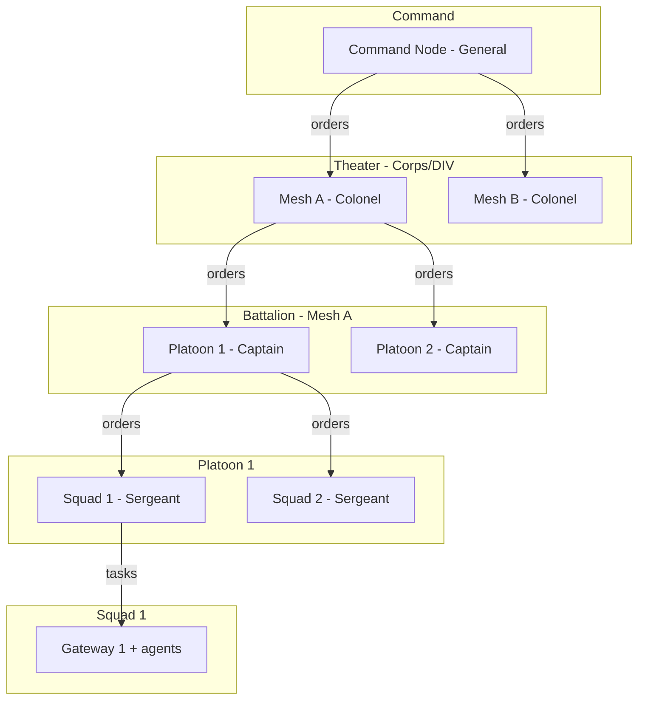
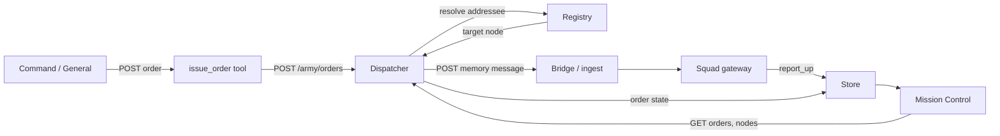

# Army of OpenClaw — US Army–Style Design

Design for a **hierarchical, military-style organization** of OpenClaw gateways and agents: chain of command, ranks/roles, units (squad through theater), orders flow, personnel registry (discovery), and Mission Control as the command post. Builds on the existing [mesh](PRD.md), [bridge](bridge/README.md), [federation hub](OPENCLAW_MESH_FEDERATION_HUB.md), and [Mission Control](OPENCLAW_MISSION_CONTROL_DASHBOARD.md) without changing the OpenClaw gateway or agent protocol.

**Last updated:** February 2026

---

## 1. US Army → OpenClaw mapping

| US Army concept | OpenClaw equivalent |
|-----------------|----------------------|
| **Chain of command** | Hierarchy of gateways/agents: orders flow down, reports (task results) flow up. |
| **Rank** | Role/authority: who can issue orders to whom (e.g. General = command node, Colonel = theater lead, Captain = gateway owner, Sergeant = squad lead agent, Specialist = specialist agent). |
| **Unit** | Grouping of gateways or agents: Squad (one gateway + its agents), Platoon (several gateways under one lead), Company/Battalion (mesh or region), Theater (federation of meshes). |
| **MOS (Military Occupational Specialty)** | **Skill descriptor**: what this node/agent can do (research, coding, triage, etc.) — see [OPENCLAW_MESH_KNOWLEDGE_SKILLS_SHARING.md](OPENCLAW_MESH_KNOWLEDGE_SKILLS_SHARING.md) and [mesh request-response](mesh/request-response.md). |
| **Orders** | **Structured task**: type, priority, addressee (unit or role), payload, deadline; sent over bridge or via dispatcher. |
| **Personnel roster** | **Registry**: which gateways/agents exist, their rank, unit, and capabilities; supports “who can do X?” and “send order to 2nd Squad.” |
| **Command post** | **Mission Control** extended with: unit view, roster, orders queue, optional missions (campaigns). |
| **Logistics / intel** | **Mesh memory and skills**: shared context, procedures, SOUL/skills (already in place). |

Memory (intel) can be **pushed via the Federation Hub** (store or `POST /federation/share`), then shared to the internal mesh and optionally to external meshes. **Rank and unit/theater** control who may push and who may receive. See [OPENCLAW_FEDERATION_HUB_INTEL_SHARE.md](OPENCLAW_FEDERATION_HUB_INTEL_SHARE.md).

---

## 2. Hierarchy and units (structure)

- **Command node:** Single gateway (or Mission Control–designated “commander”) that issues orders to theater/mesh leads. Today this can be the **CEO** gateway ([OPENCLAW_MAC_MINI_CEO_PROMPTS.md](OPENCLAW_MAC_MINI_CEO_PROMPTS.md)).
- **Theater:** A **mesh** or **federation**. Colonel = mesh lead (one gateway designated as lead for that mesh).
- **Battalion / Company:** Logical grouping of gateways inside a mesh (e.g. by region or function). Optional; can be a tag on gateways.
- **Platoon:** Small group of gateways (e.g. 2–4) with a **platoon lead** gateway that receives orders and delegates to its squads.
- **Squad:** One **gateway** plus its agents (e.g. Sec + agents). Sergeant = default or “squad lead” agent on that gateway.
- **Soldier:** An **agent** on a gateway (e.g. Research, Coding, Sec). Specialist/Private by role.

Implementation can start **flat**: Command → Squads (gateways). Add Platoon/Battalion/Theater as **tags** (e.g. `unit`, `platoon`, `theater`) in the registry and in orders for routing.

**Order data flow (Command → Squad):**

---

## 3. Ranks and roles (authority and capability)

- **Rank** (authority): Who can give orders to whom. Stored in registry per gateway or agent (e.g. `rank: "captain"`). Rules: General can order anyone; Colonel within theater; Captain within battalion; Sergeant within platoon; Specialist/Private receive orders only.
- **Role / MOS** (capability): What this node can do — from existing **skill descriptors** ([OPENCLAW_MESH_KNOWLEDGE_SKILLS_SHARING.md](OPENCLAW_MESH_KNOWLEDGE_SKILLS_SHARING.md) §2.4, Option D). E.g. `skills: ["research", "triage", "coding"]`. Used for **task routing**: “Send research task → any node with skill research and capacity.”
- **Unit assignment:** Each gateway (and optionally agent) has `unit`, `platoon`, `theater`. Orders can be addressed to `unit: "squad-2"` or `role: "research"` or `gatewayId: "sec"`.

No change to OpenClaw agent model; ranks and units are **metadata** in the registry and in SOUL/context as needed.

### 3.2 Skills and tools by rank

For consistent **discovery/routing** (registry, dispatcher) and **least-privilege execution**, each rank has defined **advertised skills (MOS)** and **allowed/forbidden tools**. See [OPENCLAW_ARMY_SOUL_BY_RANK.md](OPENCLAW_ARMY_SOUL_BY_RANK.md) for copy-paste SOUL prompts per rank.

**Registry skills (MOS) by rank** — used for routing and discovery (`GET /army/nodes?skill=research`):

| Rank | Advertised skills (MOS) | Purpose |
|------|--------------------------|---------|
| General | `command`, `orders`, `synthesize` | Command node issues orders; synthesizes reports from below. |
| Colonel | `theater_lead`, `delegate`, `report_up` | Theater lead delegates to Captains; reports up. |
| Captain | `platoon_lead`, `delegate`, `report_up` | Platoon lead delegates to Sergeants; reports up. |
| Sergeant | `squad_lead`, `delegate`, `report_up` (or execute) | Squad lead delegates to agents on gateway or executes. |
| Specialist | One or more of `research`, `coding`, `triage`, `notes`, etc. | Task execution only; no delegation. |

**Tools by rank** — OpenClaw and custom Army tools:

| Rank | Allowed OpenClaw tools | Custom Army tools | Forbidden |
|------|------------------------|-------------------|-----------|
| General | `memory`; optional `sessions_spawn` to local staff agents | `issue_order` (POST to dispatcher) | exec, browser |
| Colonel | `memory` | receive orders; `forward_order` (delegate down); `report_up` | exec |
| Captain | `memory` | receive orders; `forward_order`; `report_up` | exec |
| Sergeant | `memory`; `sessions_spawn` to local agents; optional exec if squad does coding | receive orders; `report_up` | (exec only if MOS allows) |
| Specialist | `memory`; execute tools by MOS (research = web/search; coding = exec in sandbox; triage = memory + reply) | receive orders; `report_up` | order issuance, delegation |

**Recommended LLM model(s) by rank** — Operators can align quality/cost and SOUL prompts with model choice. Use an ordered list (first choice, fallback) for failover. Per-node `model_ranking` in the registry overrides this when set.

| Rank | Recommended model(s) | Notes |
|------|----------------------|-------|
| General | Prefer strongest (e.g. Claude Opus, GPT-4) | Synthesis and high-level delegation. |
| Colonel | Strong (e.g. Claude Sonnet, GPT-4) | Theater lead; delegates and reports up. |
| Captain | Strong or moderate (e.g. Claude Haiku, GPT-4o-mini) | Platoon lead; delegates and reports. |
| Sergeant | Moderate (e.g. Llama 3, local Ollama) | Squad lead or executes; can use smaller models. |
| Specialist | Smaller/faster (e.g. Llama, local Ollama) or moderate by MOS | Task execution; SOUL + MOS constrain behavior. |

- **Issue order:** General (and optionally Colonel/Captain) use a **tool or script** that POSTs an order to the dispatcher (orderId, addressee, payload, priority). Documented in [OPENCLAW_ARMY_OF_OPENCLAW.md](OPENCLAW_ARMY_OF_OPENCLAW.md) §6.
- **Report up:** Sergeants and Specialists submit results via bridge or PUT to store so the issuer and Mission Control consume them.

**Shared mesh skills (by rank/unit):** Skills (SOUL snippets, procedures) can be shared across the mesh via federation hub or mesh store ([OPENCLAW_MESH_KNOWLEDGE_SKILLS_SHARING.md](OPENCLAW_MESH_KNOWLEDGE_SKILLS_SHARING.md)). Rank and unit/theater can restrict **who receives** which shared skills (e.g. “Report format for Sergeants,” “Order acknowledgment template for Captains”) using scope or `targetUnit` / `rank` in intel-share ([OPENCLAW_FEDERATION_HUB_INTEL_SHARE.md](OPENCLAW_FEDERATION_HUB_INTEL_SHARE.md)).

---

## 4. Orders (task format and flow)

- **Order:** Structured message (over bridge or dispatcher) with at least: `orderId`, `type` (e.g. task, query, report-request), `addressee` (gatewayId, unit, or role), `payload` (task text, params), `priority`, `deadline`, `from` (issuer node/id).
- **Flow:** Command (or any authorized node) **issues order** → **Dispatcher** or bridge **routes** to addressee(s). Addressee gateway/agent **executes** and **reports** (result) back via bridge or store. Reports consumed by Mission Control and by the issuer.
- **Existing bridge:** Today CEO posts a task to the bridge and Sec receives it ([OPENCLAW_MAC_MINI_CEO_PROMPTS.md](OPENCLAW_MAC_MINI_CEO_PROMPTS.md) §4). Orders generalize this: same bridge (or dedicated “orders” channel), with a **structured envelope** (orderId, addressee, payload, priority) so a **dispatcher** or receiving gateway can route and track.

**Order data shape (reference):**

| Field | Type | Description |
|-------|------|-------------|
| `orderId` | string | Unique id for tracking. |
| `type` | string | e.g. `task`, `query`, `report-request`. |
| `addressee` | object or string | `gatewayId`, or `unit`, or `role` (skill/capability). |
| `payload` | object or string | Task text, params, context. |
| `priority` | string or number | e.g. `high`, `normal`, `low` or 1–5. |
| `deadline` | number (optional) | Unix timestamp. |
| `from` | string | Issuer node or gateway id. |
| `ts` | number | Unix timestamp. |

---

## 5. Personnel registry (discovery)

- **Purpose:** “Who exists, where are they, what can they do?” so the command post and dispatcher can route orders.
- **Contents (per “soldier” = gateway or agent):** id, gatewayId, agentId (optional), rank, unit, platoon, theater, skills (list), status (available, busy, offline), optional capacity (e.g. max tasks).
- **Population:** Manual config at first (e.g. in Mission Control gateway list plus optional rank/unit/skills). Later: gateways **register** on startup (POST to registry API) and **advertise** skill descriptors (periodically or on change); registry stores and indexes them.
- **Registry freshness:** Optional **heartbeat** or periodic re-registration (POST /army/register with same id updates `updated_at`). Nodes that have not updated within a **TTL** (e.g. 5–10 minutes) can be treated as stale: dispatcher may mark them `offline` or exclude them from routing; a background job or dispatcher can set `status = 'offline'` when `updated_at` is older than TTL. Config: e.g. `ARMY_REGISTRY_TTL_SEC`.
- **Implementation option A:** New service or extension of mesh store: `army/registry` table or API (`GET /army/units`, `GET /army/nodes?skill=research`, `POST /army/register`). Backed by SQLite or existing store schema extension. Reference implementation: [army/server.js](army/server.js) and [mesh/store/client.js](mesh/store/client.js).
- **Implementation option B:** Bridge-based discovery (Option D in [OPENCLAW_MESH_KNOWLEDGE_SKILLS_SHARING.md](OPENCLAW_MESH_KNOWLEDGE_SKILLS_SHARING.md)): nodes post skill summaries to the bridge; a **registry sidecar** ingests and maintains the roster.

**Registry row (reference):**

| Field | Type | Description |
|-------|------|-------------|
| `id` | string | Unique roster id. |
| `gatewayId` | string | OpenClaw gateway id (matches Mission Control). |
| `agentId` | string (optional) | Agent on that gateway, if registering per-agent. |
| `rank` | string | e.g. `general`, `colonel`, `captain`, `sergeant`, `specialist`, `private`. |
| `unit` | string | e.g. `squad-1`, `2nd-platoon`. |
| `platoon` | string (optional) | Platoon id. |
| `theater` | string (optional) | Mesh or theater id. |
| `skills` | string[] | Capability list (e.g. research, coding, triage). |
| `status` | string | `available`, `busy`, `offline`. |
| `capacity` | number (optional) | Max concurrent tasks. |
| `model_ranking` | string[] (optional) | Array of model ids (e.g. `["claude-3-opus","gpt-4","ollama/llama3"]`) for this node; overrides rank default when set. |
| `updated_at` | number | Unix timestamp. |

---

## 6. Dispatcher (task router)

- **Role:** Receives **orders** from Command (or any authorized issuer); looks up **registry** for addressee (by unit, role, or gatewayId); selects target(s); **sends task** to the right bridge channel or gateway webhook; optionally **tracks** (orderId → status, result) and **retries** or **failover** if target is down or busy.
- **Placement:** New component (e.g. `army/dispatcher.js` or part of Mission Control proxy): subscribes to “orders” or is called by Command gateway (tool that POSTs order to dispatcher). Dispatcher uses registry + routing rules (e.g. “research → any node with skill research, least loaded”) and posts to bridge or gateway ingest. Reference implementation: [army/server.js](army/server.js).
- **Routing rules:** Resolve addressee in order: (1) exact **gatewayId** if given; (2) **unit** (all nodes in unit, then pick one); (3) **role/skill** (all nodes with that skill, then pick one). When multiple candidates exist, prefer **least loaded** (e.g. by count of in_progress orders per node) or **least recently used**. Process orders by **priority** (e.g. high before normal before low) and optionally by **deadline** (soonest first).
- **Resilience:** If target unavailable, dispatcher can try next candidate (same role/unit) or queue order and retry; optional timeout and dead-letter (store failed orders for review). See §8 below.

---

## 7. Mission Control as command post

- **Current:** Mission Control already aggregates gateways, tasks, jobs, approvals, activity ([OPENCLAW_MISSION_CONTROL_DASHBOARD.md](OPENCLAW_MISSION_CONTROL_DASHBOARD.md)).
- **Army extensions (design):**
  1. **Unit view:** Group gateways by unit/platoon/theater and show hierarchy.
  2. **Roster:** Tab or panel showing registry (nodes, rank, unit, skills, status).
  3. **Orders queue:** List of orders (pending, in progress, completed, failed) and ability to issue a new order (form: addressee, payload, priority).
  4. **Missions:** Optional “mission” = named set of orders with a goal; show progress (e.g. 3/5 completed).

Data source: registry API + dispatcher API (or store where dispatcher writes order state).

---

## 8. Resilience (failover, timeout, dead-letter)

- **Failover:** When dispatcher sends an order to a node (by role or unit), if that node is offline or returns error, dispatcher selects **next candidate** from registry (same role/unit, status available) and retries. Optional **max retries** per order (e.g. 3); after exhaustion, mark order as failed and write to dead-letter.
- **Timeout:** Orders may have a `deadline` (Unix timestamp). Dispatcher or a background job marks order as **failed** or **timed out** when deadline passes without result; optional escalation (e.g. notify issuer or reassign to another node).
- **Dead-letter:** Failed or timed-out orders remain in store with `status = 'failed'` and optional `error` reason. Dispatcher exposes `GET /army/orders?status=failed` for review and optional replay (re-submit with same or new orderId).
- **Registry TTL:** See §5 — nodes not seen within TTL can be excluded from routing or marked `offline`.

**Escalation (refused or failed orders):**
- When a **Sergeant or Specialist** cannot execute, they **report_up** with `status: "refused"` and `reason` (see [OPENCLAW_ARMY_SOUL_BY_RANK.md](OPENCLAW_ARMY_SOUL_BY_RANK.md) refuse-order protocol). The issuer (General/Colonel/Captain) or Mission Control can **reassign** or **re-issue**.
- **Who can reassign:** (1) **Dispatcher auto-failover** — on delivery failure (node offline, ingest error), the dispatcher tries the next candidate (same role/unit) up to max retries; (2) **Manual re-issue** — from Mission Control (Orders queue → Issue order with same payload and a new orderId) or by the Command gateway issuing a new order. There is no automatic “re-route refused order” today; the chain or operator decides whether to send to another node or escalate to a different role.

---

## 8b. Security (order issuer, audit)

- **Order issuer check:** Dispatcher (or proxy) may verify that the issuer is allowed to issue orders. When auth is enabled (e.g. `ARMY_AUTH_BEARER`), optional **rank check**: require header `X-Node-Id` and lookup in registry; allow only ranks that may issue orders (e.g. `general`, `colonel`, `captain` per chain of command). Reject with 403 if issuer rank is not allowed.
- **Audit:** Log order issuance and delivery (orderId, from, addressee, target_node_id, ts) for compliance. Optional: write to an audit table or structured logs consumed by existing [OBSERVABILITY](OBSERVABILITY.md) pipeline.

---

## 9. References and related docs

| Doc | Purpose |
|-----|---------|
| [OPENCLAW_ARMY_SOUL_BY_RANK.md](OPENCLAW_ARMY_SOUL_BY_RANK.md) | Copy-paste SOUL prompts per rank (General, Colonel, Captain, Sergeant, Specialist) and skills/tools. |
| [PRD.md](PRD.md) | Mesh, shared memory, skills, federation hub. |
| [OPENCLAW_FEDERATION_HUB_INTEL_SHARE.md](OPENCLAW_FEDERATION_HUB_INTEL_SHARE.md) | Intel share: memory via hub (store or share endpoint); rank/unit/theater push and receive. |
| [OPENCLAW_MESH_KNOWLEDGE_SKILLS_SHARING.md](OPENCLAW_MESH_KNOWLEDGE_SKILLS_SHARING.md) | Discovery, skill descriptors, Option D registry over bridge. |
| [mesh/request-response.md](mesh/request-response.md) | Request/response over bridge (memory/skill). |
| [OPENCLAW_MAC_MINI_CEO_PROMPTS.md](OPENCLAW_MAC_MINI_CEO_PROMPTS.md) | CEO → Sec delegation, bridge, task flow. |
| [OPENCLAW_MESH_FEDERATION_HUB.md](OPENCLAW_MESH_FEDERATION_HUB.md) | Federation hub; theater = mesh. |
| [OPENCLAW_MISSION_CONTROL_DASHBOARD.md](OPENCLAW_MISSION_CONTROL_DASHBOARD.md) | Mission Control; command post extensions. |

---

## 10. Summary

- **Army of OpenClaw** = hierarchical organization of gateways/agents with **chain of command**, **ranks/roles**, **units** (squad → platoon → theater), **orders** (structured tasks), **personnel registry** (discovery), and **dispatcher** (routing + optional failover).
- **Mission Control** becomes the **command post** (unit view, roster, orders queue, issue order form). Reference: Mission Control dashboard with “Army — Command Post” section when `OPENCLAW_MC_ARMY_URL` is set; [army/server.js](army/server.js) and [army/README.md](army/README.md).
- **Reference implementation:** Registry + dispatcher in [army/](army/); store schema and client in [mesh/store](mesh/store/). No OpenClaw gateway or agent protocol change required.
