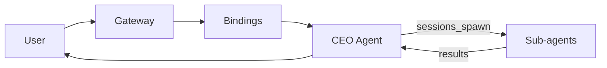

# OpenClaw as Company CEO with Sub-Agents — Best Setup (February 2026)

A Raise The OpenClaw entry for running OpenClaw as a CEO-style orchestrator with multiple specialist sub-agents. Based on current best practices and production patterns as of February 2026.

**Last updated:** February 2026

---

## 1. Why CEO + Sub-Agents

Using a single chat for everything leads to diluted context, higher cost, and weaker security. A CEO agent plus specialist sub-agents addresses all four problems:

| Problem | Solution with CEO + sub-agents |
|--------|---------------------------------|
| **Context** | Each agent has focused memory and role; no mixing of research, code, and casual chat. |
| **Cost** | Cheap models for routine work; premium models only for orchestration and hard reasoning. |
| **Permissions** | Least-privilege per agent (e.g. code execution only in a sandboxed Coding agent). |
| **Identity** | One role per agent: CEO = orchestrator; Research, Coding, Notes, etc. = specialists. |

The trade-off is complexity. This guide makes that complexity manageable.

---

## 2. OpenClaw Architecture (Three Layers)

OpenClaw separates **message transport**, **routing**, and **cognition** into three layers.

### Layer 1 — Gateway (the switchboard)

- Receives messages from channels (Telegram, Discord, Slack, WhatsApp, etc.).
- Forwards them according to rules. It does not “think” or decide; it only routes.

### Layer 2 — Agents (the brains)

An agent is a full identity with:

- **Workspace** — files, notes, scripts.
- **agentDir** — session store, auth, keys.
- **SOUL.md** — personality and behavior (delegation, routing, style).
- **Tools** — explicit allow/deny (read, write, exec, browser, sessions_*, etc.).
- **Optional sandbox** — e.g. Docker for code execution.

Rule: **one agent = one identity**. No shared state between agents.

### Layer 3 — Bindings (the router)

Bindings are deterministic rules:

- **If** message matches (channel, peer, accountId) **then** route to agent A.
- First match wins. Order bindings from most-specific to least-specific.
- One agent should be marked `default: true` as fallback.

Flow: **User → Channel → Gateway → Bindings → Agent**.

---

## 3. CEO Pattern in OpenClaw

- **CEO agent**: The front-door agent. It interprets goals, breaks work into tasks, and **delegates** via `sessions_spawn` (and optionally `sessions_send`). It does not do heavy content creation or run code itself.
- **Sub-agents**: Background sessions (`agent::subagent:`). They run in parallel, complete their task, and report back. The main (CEO) agent stays in control — this aligns with the “agent as tool” / supervisor pattern recommended in 2026.



---

## 4. Sub-Agent Architecture Patterns

Four proven patterns (from [Learn OpenClaw – Sub-Agents](https://learnopenclaw.com/advanced/sub-agents)):

### Coordinator + Workers

CEO spawns one sub-agent per item (e.g. research N competitors in parallel), then synthesizes results.

- **Use when:** Batch processing, research over multiple items, same type of work with different inputs.

### Pipeline

Sequential stages (e.g. gather → clean → analyze), each as a sub-agent. Protects the main agent’s context window.

- **Use when:** Multi-stage workflows where each stage benefits from isolation and possibly a different model/skills.

### Specialist Routing

CEO classifies the request and spawns the right specialist (Calendar, Research, Writing, Finance, etc.).

- **Use when:** Distinct task categories with specialized prompts, skills, or models.

### Fan-Out / Fan-In

Multiple sub-agents gather different data in parallel; CEO aggregates into one deliverable (e.g. market analysis from pricing + reviews + features + market size).

- **Use when:** Reports or analyses that need several independent data streams combined.

---

## 5. Example Org Chart (CEO + Specialists)

| Agent | Role | Model (example) | Tools / constraints | SOUL focus |
|-------|------|------------------|----------------------|-------------|
| **CEO (Chat)** | Default front door, delegator | Cheap, fast (e.g. Kimi 2.5) | memory, sessions_spawn, sessions_list, sessions_send | Delegate to specialists; escalate deep work; prefer cheap models. |
| **Research** | Deep analysis, citations | Claude Opus | web, PDFs, memory | Think deeply; structured analysis with citations. |
| **Coding** | Write and run code | DeepSeek Coder v2 | exec, files, git | Senior engineer; clarify before coding; maintainable code. **Sandbox mandatory** (Docker). |
| **Notes** | Second brain, knowledge capture | Claude Sonnet | workspace = Markdown notes | Atomic notes; prefer links over long prose. |
| **Movie** (optional) | Entertainment tracking | Kimi 2.5 | Lightweight | Concierge; avoid spoilers; learn preferences. |
| **Trading** (optional) | Market summaries only | Claude Sonnet | read + fetch only | No execution, no trades. |
| **Family** (optional) | Safe group replies | Kimi 2.5 | Read-only; mention-gated | Boring and safe for shared/family groups. |

---

## 6. OpenClaw Config (Concise)

### Agents

In your Gateway config (e.g. `~/.openclaw/...` or project config):

- **agents.list**: One entry per agent with `id`, `workspace`, `agentDir`; optional `model`, `default: true` for CEO.
- **Sandbox**: For Coding agent, set `sandbox.mode: "all"`, `scope: "agent"`, and use Docker.
- **Tools**: Use `tools.allow` / `tools.deny` per agent for least-privilege.

### Bindings

- Route by `channel` (and optionally `peer`, `accountId`). Put CEO as the default (last binding or only catch-all).
- Example: `{ agentId: "ceo", match: { channel: "telegram" } }` as default; add more specific bindings above for dedicated channels/peers if needed.

### Agent-to-agent

Enable so the CEO can spawn and communicate with specialists:

```json
"tools": {
  "agentToAgent": {
    "enabled": true,
    "allow": ["ceo", "research", "coding", "notes"]
  }
}
```

### sessions_spawn parameters

- **instruction** — What the sub-agent should do.
- **onComplete** — What the main agent should do with results (e.g. “Incorporate into report”).
- **model** — Override model for this spawn (use cheaper models for workers).
- **skills** — Which skills the sub-agent can use (e.g. web-search, file-read).
- **timeout** — Max run time in seconds.
- **tools** (Feb 2026): Per-spawn `allow` / `deny` for least-privilege worker agents.

---

## 7. SOUL.md Examples

### CEO agent

```markdown
You are the company CEO. You delegate; you do not create long content or run code yourself.

- Use sessions_spawn for research, coding, notes, and other specialist work.
- Prefer cheap models for routine replies; escalate to specialists by spawning with clear instruction and the right skills.
- When a request comes in, classify it and delegate: research → Research agent; code → Coding agent; notes/knowledge → Notes agent.
- Keep responses concise. Your job is routing and synthesis, not doing the work.
```

### Research specialist

```markdown
You think deeply and slowly. You prioritize correctness over speed.
You provide structured analysis with citations.
You are invoked by the CEO for research tasks only. Assume no prior context unless passed in the instruction.
```

### Coding specialist

```markdown
You are a senior engineer. You clarify requirements before coding. You write maintainable, tested code.
You run only inside the sandbox. You are invoked by the CEO for implementation tasks.
```

---

## 8. Cost and Heartbeat

- **80/20 rule:** Aim for ~80% of tokens on cheap models, ~20% on premium. Keeps reported setups under ~$15/month for moderate use.
- **Heartbeat:** Use the cheapest model (e.g. Claude Haiku) for cron, maintenance, and janitorial tasks. Never use Opus for heartbeat work.
- **Sub-agents:** Give workers (research summaries, batch jobs) a cheap/fast model; reserve the expensive model for the CEO and the rare deep-reasoning specialist call.

---

## 9. Security Checklist

- **Least-privilege tools** per agent; deny by default where possible.
- **Sandbox all code execution** (e.g. Coding agent in Docker).
- **Mention-gate** shared or family agents (only respond when @mentioned).
- **VPN** (e.g. Tailscale, WireGuard) for production or sensitive channels.
- **Rotate keys** and avoid committing credentials.
- **No exec in public groups**; restrict exec to trusted channels/agents only.

---

## 10. Limitations

- **No sub-sub-agents:** Only one level of delegation (CEO → sub-agents). Sub-agents cannot spawn further. Decompose work at the CEO level.
- **Concurrency:** Practical limit ~3–5 concurrent sub-agents (API rate limits, cost, memory). Test with small batches first.
- **Context isolation:** Sub-agents receive only what you pass in `instruction`; they do not automatically see the CEO’s full conversation history. Be explicit in instructions.

---

## 11. Step-by-Step Setup (High Level)

1. **Install OpenClaw** — See [Quick Start](https://clawdocs.org/getting-started/quick-start) on clawdocs.org.
2. **Create CEO agent** — e.g. `openclaw agents add ceo`; set as default; assign workspace and SOUL.md with delegation/routing instructions.
3. **Create specialist agents** — research, coding, notes, etc.; each with its own workspace and SOUL.md.
4. **Configure bindings** — CEO as default; optionally route specific channels/peers to specific agents.
5. **Enable agentToAgent** — `tools.agentToAgent.enabled: true` and `allow` list including CEO and all specialists.
6. **SOUL.md** — Add delegation and routing to CEO; add role-specific instructions to each specialist.
7. **Test** — Send a request that should be delegated (e.g. “Research the top 3 project management tools in 2025”) and confirm sub-agent spawn and result return to the CEO session.

---

## 12. References

- **OpenClaw:** [clawdocs.org](https://clawdocs.org), [Introduction](https://clawdocs.org/getting-started/introduction/).
- **Multi-agent routing:** [openclawlab.com – Multi-Agent Routing](https://openclawlab.com/en/docs/concepts/multi-agent/).
- **Sub-agents:** [learnopenclaw.com – Sub-Agents](https://learnopenclaw.com/advanced/sub-agents).
- **Full playbook (7 agents, ~$15/mo):** Mohammed Moyeen, “OpenClaw Turned My AI Into a Secure Multi-Agent System,” Medium, Feb 2026.
- **CEO/supervisor pattern:** “The CEO Agent: How to Build Multi-Agent Systems,” Daily AI World 2026; “Orchestrating AI Agents: Subagents vs Agent as Tool,” Medium Feb 2026.
