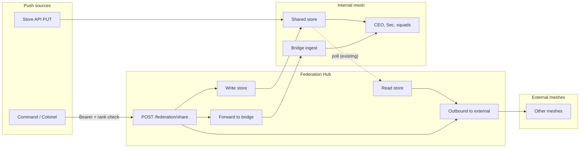

# OpenClaw Federation Hub — Intel Share and Army Ranking

Design for **passing memory (intel/logistics) to the Federation Hub** via the shared store or a dedicated share endpoint, then **sharing it to the internal mesh** (bridge/store) and **optionally to external meshes**, with **Army-style ranking and network (units/theater)** controlling who can push and who can receive. Complements [OPENCLAW_MESH_FEDERATION_HUB.md](OPENCLAW_MESH_FEDERATION_HUB.md) and [OPENCLAW_ARMY_OF_OPENCLAW.md](OPENCLAW_ARMY_OF_OPENCLAW.md).

**Last updated:** February 2026

---

## 1. Purpose

- **Intel/logistics = mesh memory** (per Army design): Command or Colonels share context, procedures, and facts to the mesh. The Federation Hub is the central place where this memory is passed in and then distributed.
- **Two intake paths:** (1) **Store** — authorized callers `PUT /mesh/memory` to the shared store; hub uses store for outbound and optionally fan-out to the internal bridge. (2) **Share endpoint** — internal callers `POST /federation/share`; hub forwards to bridge, optionally writes to store, and optionally sends to external meshes.
- **Rank and unit/theater** control who may push (share or store write) and who may receive (filter by unit/theater at consumer or at hub).

---

## 2. Target flow

---

## 3. Data model: audience and targeting

Reuse existing [mesh memory message](mesh/schemas/memory-message.json) (`type`, `scope`, `key`, `value`, `nodeId`, `ts`). For Army-style targeting and federation, use **optional** fields. **v1 (Option A):** Store them in `value` as structured metadata so no schema change is required:

- `value = { _meta: { audience, targetUnit, targetTheater }, ...rest }`

| Field | Type | Description |
|-------|------|-------------|
| `audience` | `"internal"` \| `"federation"` \| `"both"` | Default `both`: internal mesh only, external only, or both. |
| `targetUnit` | string (optional) | e.g. `squad-1`, `2nd-platoon`. Only nodes in this unit (per registry) should apply. Empty = all. |
| `targetTheater` | string (optional) | e.g. `theater-a`. Only gateways in this theater receive. Empty = all. For outbound, only external meshes with matching `theater` id get it. |

**Future (Option B):** Extend mesh memory schema and store schema so `audience` / `targetUnit` / `targetTheater` are first-class columns or a JSON column.

---

## 4. Path 1 — Store as intake

- **Who:** Command, dispatcher, or any node with **store API auth** (Bearer or API key). See [mesh/store/api-server.js](mesh/store/api-server.js).
- **How:** `PUT /mesh/memory` (and optionally `PUT /mesh/skills`) to the shared store. Body: `scope`, `key`, `value`, `node_id`. Use `scope: "mesh"` for internal-only, or `scope: "federation"` so hub outbound picks it up. Targeting via `value._meta` (see above).
- **Hub behavior:**
  - **Outbound (existing):** Hub already polls store by `outboundScope` (e.g. `federation`), builds mesh messages, POSTs to external meshes. No change.
  - **Internal mesh:** The hub does not push store → bridge by default. Option **3a** (recommended): hub **store-to-bridge** fan-out — periodically read store (e.g. scope `mesh` and `federation`), build memory messages, POST to `internal.bridgeWebhookUrl`. Optional filter by `targetTheater` when `internal.thisTheater` is set. Option **3b:** separate sidecar that reads store and POSTs to bridge.
- **Push control:** Store API is already protected by `MESH_STORE_AUTH_*`. Restrict who has that auth (e.g. only Command/Colonel gateways). Optional extension: store API accepts `X-Node-Id` and checks an army registry that this node has rank allowed to "share intel" (e.g. `general`, `colonel`).

---

## 5. Path 2 — Dedicated share endpoint

- **Endpoint:** `POST /federation/share` on the Federation Hub.
- **Auth:** Internal only. `Authorization: Bearer <token>` where token is configured per hub (`internal.shareSecret` or `internal.shareBearer`). Optionally require `X-Node-Id` and validate against army registry (rank allows share).
- **Body:** JSON — either:
  - Single mesh message or array of messages (same shape as [mesh messages](mesh/README.md)), or
  - Wrapper: `{ "messages": [...], "audience": "both", "targetUnit": "", "targetTheater": "" }`. If wrapper present, hub applies audience/targeting to all messages (e.g. embed in `value._meta` for memory messages).
- **Hub behavior:**
  1. Validate auth (and optionally registry rank via `internal.registryUrl` + `GET /army/nodes/:id`).
  2. For each message: apply optional `audience` / `targetUnit` / `targetTheater` (embed in `value._meta` for memory messages).
  3. **Internal mesh:** POST to `internal.bridgeWebhookUrl`. Existing [bridge/adapter.js](bridge/adapter.js) and [mesh/bridge-ingest.js](mesh/bridge-ingest.js) consume.
  4. **Store:** If `internal.storeApiUrl` is set, write each memory/skill to store (PUT to store API) so outbound can resend later.
  5. **External meshes:** If `audience` is `federation` or `both`, either **defer to next outbound poll** (recommended for v1) or **immediate send** (config flag). When sending, only include messages with audience including federation; optionally filter by `externalMeshes[].theater` vs message `targetTheater`.
- **Receive control:** v1: forward all to bridge; filtering by unit/theater at **consumer** (each node checks registry and applies only if in target unit/theater). Later: hub can filter by `internal.thisTheater` when forwarding to bridge.

---

## 6. Ranking and network (units/theater)

- **Push (who can send):**
  - **Share endpoint:** Auth by `internal.shareSecret` or `internal.shareBearer`. Optional: `X-Node-Id` + `internal.registryUrl` → `GET /army/nodes/:id` and allow only `rank` in `["general", "colonel"]`.
  - **Store:** Existing store API auth; optional future: `X-Node-Id` + registry check for "share intel" rank.
- **Receive (who gets what):**
  - **Internal mesh:** Messages on the bridge or in the store can include `targetUnit` / `targetTheater` in `value._meta`. Consumers (gateways/agents or tools) read registry, know their own `unit`/`theater`, and apply only memory where target is empty or matches.
  - **External meshes:** Hub outbound filters by `outboundScope` and `outboundKeysAllowList`. Optional: only send to external meshes whose `theater` (config `externalMeshes[].theater`) matches message `targetTheater` when set.

Registry row reference: [OPENCLAW_ARMY_OF_OPENCLAW.md](OPENCLAW_ARMY_OF_OPENCLAW.md) §5 (`rank`, `unit`, `platoon`, `theater`). Hub and store do not implement the registry; they consume it via config or optional API (`internal.registryUrl`).

---

## 7. Federation hub config (additions)

| Key | Description |
|-----|-------------|
| `internal.shareSecret` or `internal.shareBearer` | Token required for `POST /federation/share`. If set, share endpoint is enabled. |
| `internal.registryUrl` | (Optional) Base URL for army registry; hub calls `GET /army/nodes/:id` to check rank when `X-Node-Id` present. |
| `internal.thisTheater` | (Optional) This hub's theater id; used to filter share→bridge by `targetTheater`. |
| `externalMeshes[].theater` | (Optional) External mesh theater id for receive filtering. |
| `internal.shareWriteToStore` | (Optional) If true, share endpoint writes each message to store when `internal.storeApiUrl` is set. Default true when store is configured. |
| `internal.shareImmediateOutbound` | (Optional) If true, share endpoint immediately POSTs to external meshes for messages with audience federation/both; otherwise defer to outbound poll. Default false. |
| `internal.storeToBridgeIntervalMs` | (Optional) If set, hub periodically reads store (scopes mesh + outboundScope) and POSTs to bridge for internal mesh. Omit to disable store-to-bridge fan-out. |

---

## 8. Reference implementation summary

- **[federation-hub/server.js](federation-hub/server.js):**
  - `POST /federation/share`: parse body (single message, array, or wrapper with `messages`, `audience`, `targetUnit`, `targetTheater`). Auth via `internal.shareSecret` or `internal.shareBearer`. Forward to bridge; optionally write to store; optionally immediate outbound per config.
  - Optional **store-to-bridge** fan-out: when `internal.storeToBridgeIntervalMs` is set, timer reads store and POSTs to `internal.bridgeWebhookUrl`.
- **Mesh message schema:** Unchanged; audience/targeting in envelope or `value._meta`.
- **Store API:** No change for v1.

---

## 9. References

| Doc | Purpose |
|-----|---------|
| [OPENCLAW_MESH_FEDERATION_HUB.md](OPENCLAW_MESH_FEDERATION_HUB.md) | Federation hub topology, inbound/outbound, config. |
| [OPENCLAW_ARMY_OF_OPENCLAW.md](OPENCLAW_ARMY_OF_OPENCLAW.md) | Chain of command, ranks, units, registry, intel = mesh memory. |
| [mesh/README.md](mesh/README.md) | Mesh message formats and cache. |
| [mesh/store/README.md](mesh/store/README.md) | Store API and access model. |
| [bridge/README.md](bridge/README.md) | Bridge ingest and webhook. |
