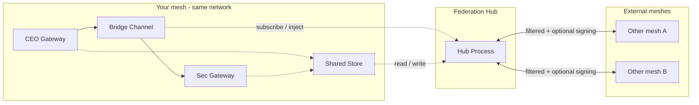

# OpenClaw Mesh Federation Hub

Design for a **Federation Hub** (mesh gateway node) that connects your internal OpenClaw mesh to **other meshes** outside your network. Complements [OPENCLAW_MESH_KNOWLEDGE_SKILLS_SHARING.md](OPENCLAW_MESH_KNOWLEDGE_SKILLS_SHARING.md), [PRD.md](PRD.md), and the [bridge](bridge/README.md).

**Last updated:** February 2026

---

## 1. Purpose

- **Internal mesh:** CEO (Mac Mini), Sec (Synology), bridge, shared memory/skills, optional shared store — all on the same logical network.
- **External meshes:** Other OpenClaw meshes (different orgs, bridges, or networks) that you want to exchange selected memory and skills with.
- **Federation Hub:** A single component that sits on your network and is the **only** gateway for cross-mesh traffic: it receives from external meshes (inbound) and sends to external meshes (outbound), with filtering and optional signing.

No change to CEO/Sec or OpenClaw gateway protocol; the hub is an additive “gateway node” for inter-mesh connectivity.

---

## 2. Topology

- **Solid lines:** Existing (bridge, store).
- **Dotted:** Federation hub subscribes to or reads from your bridge/store and injects/writes back; it exchanges **filtered** memory/skill (and optionally sync) messages with external mesh endpoints.

---

## 3. Hub Responsibilities

The hub is a **dedicated process** (or minimal relay). It does **not** run agents.

### 3.1 Inbound (external → your mesh)

1. Receive memory/skill (and optionally sync) messages at an HTTP endpoint (e.g. `POST /federation/in`).
2. **Validate:** Auth (API key / bearer per external mesh); optionally verify message **signature** (see [docs/ENTERPRISE_EXPAND.md](docs/ENTERPRISE_EXPAND.md) §5).
3. **Filter:** Allow-list of external mesh IDs and optionally scopes/keys that may be accepted; reject the rest.
4. **Provenance:** Rewrite `nodeId` to `external:<mesh-id>:<node-id>` so internal nodes and sync can tell origin.
5. **Inject:** Either (a) POST to your internal bridge webhook (existing [bridge/adapter.js](bridge/adapter.js) and [mesh/bridge-ingest.js](mesh/bridge-ingest.js) ingest as today), or (b) write to shared store via store API or [mesh/store/client.js](mesh/store/client.js).

### 3.2 Outbound (your mesh → external)

1. **Source:** Get internal messages by (a) being in the bridge path (bridge forwards a copy to hub), or (b) polling shared store / sync protocol.
2. **Filter:** Only data that is allowed to leave — e.g. `scope: "federation"` or an explicit **allow-list of keys** (e.g. `federationKeys`).
3. **Sign (optional):** Add `sig` per [ENTERPRISE_EXPAND.md](docs/ENTERPRISE_EXPAND.md) §5 before sending.
4. **Send:** POST to each configured external mesh endpoint (webhook or API).

### 3.3 Where it runs

On the **same network** as your mesh (e.g. same host as bridge webhook, NAS, or small VM) so it can call the internal bridge webhook and/or shared store API.

### 3.4 Intel share (internal)

Memory (intel/logistics) can be **passed into the hub** so it is shared to the internal mesh and optionally to external meshes. Two paths: **(1) Store** — authorized callers (e.g. Command, dispatcher) `PUT /mesh/memory` to the shared store; hub outbound already uses the store for external meshes, and an optional **store-to-bridge** fan-out lets the hub push that memory to the internal bridge. **(2) Share endpoint** — internal callers `POST /federation/share` on the hub with Bearer auth; the hub forwards to the internal bridge, optionally writes to the store, and optionally sends to external meshes (immediately or via the next outbound poll). Army-style **ranking and unit/theater** can control who may push (share or store write) and who may receive (filter by `targetUnit`/`targetTheater` at consumer or at hub). See **[OPENCLAW_FEDERATION_HUB_INTEL_SHARE.md](OPENCLAW_FEDERATION_HUB_INTEL_SHARE.md)** for the full design, data model, config, and reference implementation.

---

## 4. Scope and Data Conventions (Trust Boundary)

| Convention | Description |
|------------|-------------|
| **Internal-only** | Existing `scope: "mesh"`, `node`, `user:<id>` stay for **your** mesh only. No change to current behavior. |
| **Federation-safe** | Data that may be shared with external meshes. **Option A:** New scope `federation` — only entries with `scope: "federation"` are eligible to be sent out. **Option B:** Allow-list of keys (e.g. `federationKeys: ["user.preferences", "project.alpha.summary"]`); hub only forwards those. |
| **Provenance** | Messages from external meshes are stored with `nodeId: "external:<mesh-id>:<node-id>"` (and optionally `sourceMeshId` in message). Enables filtering and auditing. |
| **Never share** | Secrets, tokens, and internal-only keys stay internal; hub never forwards them. |

---

## 5. Hub Configuration

One config file (e.g. `federation-hub.json`) or env-based config per hub instance.

### 5.1 Internal side

| Key | Description |
|-----|-------------|
| **bridgeWebhookUrl** | URL to POST ingested messages (so they enter your mesh via existing bridge ingest). |
| **storeApiUrl** | (Optional) Shared store API base URL + auth for read/write (e.g. for pushing external data into store or polling for outbound). |
| **storeAuth** | (Optional) API key or bearer token for store API. |

### 5.2 External side (per external mesh)

| Key | Description |
|-----|-------------|
| **meshId** | Unique identifier (e.g. `mesh-a`) for provenance and allow-lists. |
| **endpoint** | URL (e.g. `https://other-mesh.example.com/federation/in`) and optional auth (API key / bearer). |
| **direction** | `inbound` \| `outbound` \| `both`. |
| **allowedInboundScopesKeys** | (Optional) Allow-list of scope or scope:key that may be accepted from this mesh. |
| **publicKey** | (Optional) For signature verification of inbound messages (Ed25519 or similar). |

### 5.3 Filtering (global or per external)

| Key | Description |
|-----|-------------|
| **outboundScope** | If set to `federation`, only entries with `scope: "federation"` are sent out. |
| **outboundKeysAllowList** | If set, only these keys (e.g. `["user.preferences"]`) may be sent out; overrides scope if both present when using key-based policy. |

### 5.4 Signing (optional)

| Key | Description |
|-----|-------------|
| **signOutbound** | If true, hub signs outbound messages (see ENTERPRISE_EXPAND §5). |
| **privateKeyPath** or **privateKeyEnv** | Path to key file or env var name for hub’s private key. |
| **verifyInbound** | If true, hub verifies `sig` on inbound messages using per-mesh `publicKey`. |

---

## 6. Protocol and Message Flow

- **Message format:** Reuse existing [mesh message formats](mesh/README.md) and [schemas](mesh/schemas/): `memory`, `skill`, and optionally `sync_summary` / `sync_delta`. Add optional `sourceMeshId` (or encode in `nodeId`) and `sig` for federation.
- **Inbound:** External mesh POSTs to hub `POST /federation/in`. Body: single mesh message or array. Hub validates, filters, rewrites `nodeId` to `external:<mesh-id>:<node-id>`, then POSTs to internal bridge webhook or writes to store.
- **Outbound:** Hub gets internal messages (bridge copy or store poll), filters by federation scope or allow-list, optionally signs, POSTs to each external mesh endpoint.

---

## 7. Security Summary

- **Auth:** Hub authenticates external callers (API key / bearer per mesh). Internal bridge or store may use existing auth.
- **Signing:** Optional; reuse [ENTERPRISE_EXPAND.md](docs/ENTERPRISE_EXPAND.md) §5 for outbound signing and inbound verification.
- **Filtering:** Allow-lists for what may enter and what may leave; never forward secrets.
- **Provenance:** All external data tagged so it can be audited or filtered by internal nodes.

---

## 8. Reference implementation

- **[federation-hub/](federation-hub/)** — Node service with `POST /federation/in` (inbound from external meshes → forward to internal bridge with provenance). Config: `config.example.json`; run: `node server.js`. See [federation-hub/README.md](federation-hub/README.md).

## 9. References

| Doc | Purpose |
|-----|---------|
| [OPENCLAW_FEDERATION_HUB_INTEL_SHARE.md](OPENCLAW_FEDERATION_HUB_INTEL_SHARE.md) | Intel share: memory via store or POST /federation/share; Army ranking and unit/theater. |
| [OPENCLAW_MESH_KNOWLEDGE_SKILLS_SHARING.md](OPENCLAW_MESH_KNOWLEDGE_SKILLS_SHARING.md) | Mesh design: shared memory and skills. |
| [PRD.md](PRD.md) | Product requirements; Federation section and topology. |
| [docs/ENTERPRISE_EXPAND.md](docs/ENTERPRISE_EXPAND.md) | Message signing and verification. |
| [bridge/README.md](bridge/README.md) | Bridge adapter and webhook. |
| [mesh/store/access-model.md](mesh/store/access-model.md) | Shared store API and auth. |
