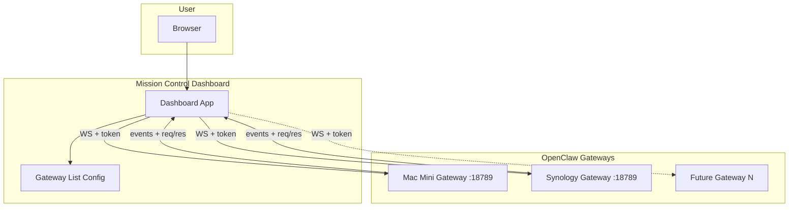

# OpenClaw Mission Control Dashboard — Two-Node and Extensible Design

A **Raise The OpenClaw** entry that **designs a Mission Control dashboard** for aggregating multiple OpenClaw gateways in one pane-of-glass. Supports the two-node setup (Mac Mini CEO + Synology Sec) and is **extensible** to N gateways. Design and spec only; no code in this repo unless you add a reference implementation later.

**Last updated:** February 2026

---

## 1. What the dashboard is

The **Mission Control dashboard** is a single UI that:

- Connects to **N OpenClaw gateways** (today: Mac Mini CEO instance and Synology Sec instance; add more by config).
- Uses each gateway’s **WebSocket control plane** (port 18789) with `operator` role and read (optionally write/approvals) scopes.
- Aggregates **status**, **agents**, **sessions**, **channels**, and (for Option A clusters) **nodes** per gateway.
- Lets you **add more nodes** by adding one gateway entry to the config — no hardcoded list of hosts.

It does **not** replace OpenClaw’s built-in Control UI per gateway; it complements it by giving one overview and drill-down across all your instances.

---

## 2. Architecture



- **Dashboard** runs as a web app (local or LAN). It loads a **gateway list** (URL, alias, token per gateway).
- For each entry it opens a **WebSocket** to that gateway (e.g. `ws://mac-mini.local:18789` or `ws://<nas-ip>:18789`; over Tailscale or SSH tunnel if the gateway is loopback-only).
- It connects with **role:** `operator`, **scopes:** `["operator.read"]` (and optionally `operator.write`, `operator.approvals`).
- It aggregates state (sessions, agents, channels, nodes, status) per gateway and shows a unified view. **Adding a gateway** = adding one row to the config and (re)connecting.

---

## 3. Gateway protocol recap

OpenClaw’s control plane is a **WebSocket** server (default: `ws://localhost:18789`). All clients (CLI, web UI, nodes) use the same protocol.

- **First frame:** must be a `connect` request. The gateway sends a `connect.challenge` (nonce); the client responds with `connect` including `role`, `scopes`, and `auth.token`.
- **Roles:** `operator` (control plane: CLI/UI/automation) or `node` (capability host for system.run, camera, etc.). The dashboard uses **operator**.
- **Operator scopes:** `operator.read`, `operator.write`, `operator.approvals`, `operator.admin`, `operator.pairing`. For read-only aggregation, `operator.read` is enough.
- **Framing:** Request `{ type: "req", id, method, params }`; Response `{ type: "res", id, ok, payload|error }`; Event `{ type: "event", event, payload }`.
- **Methods** (examples): status, channels, models, agent (list/config), sessions (list, state), nodes (list, for Option A clusters), approvals. Exact surface is in the gateway protocol schemas.

**Reference:** [OpenClaw Gateway Protocol](https://docs.openclaw.ai/gateway/protocol).

---

## 4. Config schema (extensible node list)

The dashboard is driven by a **gateway list**. Minimal schema:

### gateways (array)

Each item describes one OpenClaw gateway:

| Field | Type | Required | Description |
|-------|------|----------|-------------|
| **id** | string | Yes | Stable key (e.g. `ceo`, `sec`, `lab`). Unique in the list. |
| **name** | string | Yes | Display label (e.g. "CEO (Mac Mini)", "Sec (Synology)"). |
| **wsUrl** | string | Yes | WebSocket URL (e.g. `ws://192.168.1.50:18789` or `wss://mac-mini.tailnet:18789`). |
| **token** | string | No* | Gateway auth token. *Required unless the gateway allows unauthenticated local access. Prefer env var reference in implementation. |
| **enabled** | boolean | No | If `false`, do not connect; hide or dim in UI. Default `true`. |
| **tlsFingerprint** | string | No | For WSS: optional cert fingerprint for pinning. See [Gateway Protocol — TLS + pinning](https://docs.openclaw.ai/gateway/protocol). |
| **controlUiUrl** | string | No | Link to this gateway’s native Control UI (e.g. `http://127.0.0.1:18789`). Shown in Overview. |

**Example (two-node + one future):**

```json
{
  "gateways": [
    { "id": "ceo", "name": "CEO (Mac Mini)", "wsUrl": "ws://mac-mini.local:18789", "token": "${OPENCLAW_CEO_TOKEN}", "controlUiUrl": "http://127.0.0.1:18789" },
    { "id": "sec", "name": "Sec (Synology)", "wsUrl": "ws://192.168.1.60:18789", "token": "${OPENCLAW_SEC_TOKEN}", "controlUiUrl": "http://192.168.1.60:18789" },
    { "id": "lab", "name": "Lab", "wsUrl": "ws://lab-host:18789", "enabled": false }
  ]
}
```

### bridge (optional)

If you use the [CEO → Sec bridge](OPENCLAW_MAC_MINI_CEO_PROMPTS.md#4-ceo--sec-delegation-cross-gateway) (e.g. private Telegram/Discord channel), you can add an optional section for **informational** bridge status:

| Field | Type | Description |
|-------|------|-------------|
| **label** | string | e.g. "CEO ↔ Sec bridge". |
| **channelUrl** | string | Optional link to the bridge channel. |
| **lastActivity** | string | Optional manual or future-automated "last message" time; no protocol support today. |

This section is for human reference only; the OpenClaw protocol does not expose bridge state.

**Adding a node** = appending one object to `gateways` with a unique `id`, `name`, `wsUrl`, and token, then (re)loading the dashboard.

---

## 5. UI sections (wireframe)

| Section | Content |
|--------|--------|
| **Overview** | One card per gateway: **name**, **status** (connected / disconnected / error), **last seen** (timestamp). Optional link to that gateway’s native Control UI. "Add gateway" entry point. |
| **Gateways table** | Table: Gateway name, ID, WS status, agents count, sessions count, channels count. Sort/filter by name or status. |
| **Per-gateway detail** (drill-down or sidebar) | **Agents:** id, default flag, model. **Sessions:** active sessions summary. **Channels:** connected channels. For Option A clusters: **Nodes** attached to this gateway. Optional: **Exec approvals** pending (if `operator.approvals` scope is used). |
| **Bridge status** (optional) | If CEO↔Sec bridge is in use: short note that CEO↔Sec traffic is via channel; link to bridge channel or last activity. Informational only — no protocol support for bridge. |
| **Add / edit gateway** | Form or config edit: id, name, wsUrl, token (or env ref), enabled, optional controlUiUrl, tlsFingerprint. "Test connection" (connect once with given credentials) before save. |

**Extensibility:** The dashboard does **not** hardcode "Mac Mini" or "Synology". It renders whatever is in the **gateways** list. Adding a third (or N-th) instance = one new config entry.

---

## 6. Adding more nodes

- **Add gateway:** Append (or insert) one item in **gateways** with a unique `id`, `name`, `wsUrl`, and token. Restart or hot-reload the dashboard so it opens a new WebSocket to that URL.
- **Connectivity:** Ensure the new gateway is reachable from where the dashboard runs (same LAN, Tailscale, or SSH tunnel if loopback). Firewall: allow port 18789 (or the gateway’s bind port) from the dashboard host.
- **Optional discovery:** Future versions could support mDNS or a simple registry (e.g. gateways self-register); for v1, **manual config** is sufficient.
- **Option A vs Option B:** If you use **Option A** (one gateway + NAS as execution node), the dashboard still shows that **one gateway**; the protocol’s **nodes** (execution nodes) appear in per-gateway detail. If you use **Option B** (two independent gateways, e.g. CEO + Sec), you have two entries in **gateways**; adding a third OpenClaw instance is a third entry.

---

## 7. Security

- **Tokens:** Do not store gateway tokens in the frontend in plain text. Prefer (a) **env vars** or a **backend proxy** that holds tokens and opens WebSockets to gateways (dashboard talks only to the proxy), or (b) run the dashboard on a **trusted machine only** and use a **local config file** that is gitignored.
- **Access to gateways:** Mac Mini is **loopback-only** by default; the dashboard (or proxy) must reach it via **SSH tunnel**, **Tailscale**, or by binding the gateway to a restricted interface with auth. For Synology, restrict access to `http://<nas>:18789` (firewall, VPN, or reverse proxy with auth) as in [OPENCLAW_TWO_NODE_MAC_NAS_DESIGN.md](OPENCLAW_TWO_NODE_MAC_NAS_DESIGN.md).
- **TLS:** If gateways use **WSS**, set **tlsFingerprint** (or equivalent cert pinning) in config; see [Gateway Protocol — TLS + pinning](https://docs.openclaw.ai/gateway/protocol).

---

## 8. Reference implementation options

1. **Static + WebSocket client:** Single-page app (e.g. React, Vue, Svelte) that reads the gateway list from JSON or env; connects to each gateway via WebSocket; implements minimal protocol (connect as operator with token, then call `sessions.list`, `agent.list`, `channels.list`, `status` or equivalent). Display in tables/cards. Best for **local or trusted LAN**; tokens in env or a single local config file.
2. **Backend proxy:** Thin backend (Node, Python, etc.) that holds gateway config and tokens; opens WebSockets to gateways; exposes one REST or WebSocket endpoint to the frontend so **tokens never leave the server**. Dashboard UI talks only to the proxy. Best when the dashboard is on a **shared network**.
3. **Reuse Control UI (launcher):** Simple "mission control" = a **launcher page** with links (and optional iframes) to each gateway’s Control UI. No aggregation, but **no new code**; add node = add link. Easiest to start; upgrade to (1) or (2) when you need aggregation.

**Recommendation:** Start with **(3)** for minimal setup or **(1)** for aggregated read-only view on a trusted machine; use **(2)** when you need better token security on a shared network.

---

## 9. References

- [OpenClaw Gateway Protocol](https://docs.openclaw.ai/gateway/protocol) — WebSocket handshake, roles, scopes, methods.
- [OpenClaw Two-Node System: Mac Mini + Synology DS1621xs+ (Docker)](OPENCLAW_TWO_NODE_MAC_NAS_DESIGN.md) — Option A (one cluster) vs Option B (two instances); network and security.
- [OpenClaw Complete Prompts — Mac Mini CEO + Sec (Synology)](OPENCLAW_MAC_MINI_CEO_PROMPTS.md) — CEO/Sec roles and CEO→Sec bridge.
- [clawdocs.org](https://clawdocs.org) — OpenClaw getting started.
