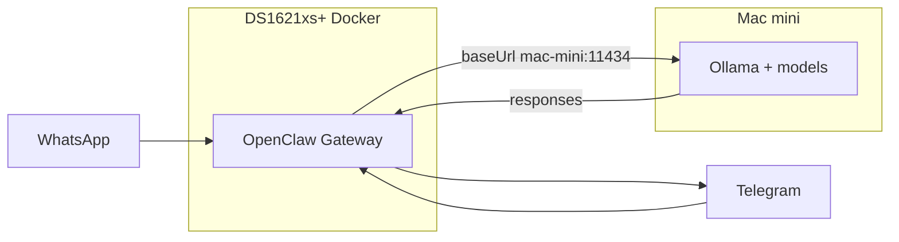

# OpenClaw Feb 2026 Best Setup: DS1621xs+ (Docker) + Mac mini

A Raise The OpenClaw entry for running the OpenClaw gateway in Docker on a Synology DS1621xs+ with local LLM inference on a Mac mini (Ollama). Based on current best practices and production patterns as of February 2026.

**Last updated:** February 2026

---

## 1. Roles: OpenClaw, NAS, Mac mini

| Component | Role |
|-----------|------|
| **OpenClaw** | Open-source AI agent (formerly Clawdbot/Moltbot) that bridges messaging (WhatsApp, Telegram, Discord, Slack, iMessage) to LLMs. Single gateway process routes messages to agents; agents use local (Ollama) or cloud (Claude, GPT) models. Self-hosted, 50+ integrations. |
| **DS1621xs+** | Synology NAS: Intel Xeon 4 cores, 8 GB RAM (expandable to 32 GB). Runs Docker via DSM. Sufficient for the **gateway only** (channels, bindings, routing). Not suitable for running large Ollama models (no unified memory/GPU). |
| **Mac mini** | Apple Silicon: ideal for local inference (unified memory, ~15–40 W, 24/7 viable). M4 Pro 64 GB is the Feb 2026 sweet spot for 30–32B models at ~10–15 tok/s. |

For CEO + sub-agents patterns on this setup, see [OpenClaw as Company CEO with Sub-Agents](OPENCLAW_CEO_SUBAGENTS_SETUP.md). (CEO on Mac Mini; Sec on Synology: see [OPENCLAW_MAC_MINI_CEO_PROMPTS.md](OPENCLAW_MAC_MINI_CEO_PROMPTS.md).)

---

## 2. Recommended architecture: Gateway on NAS, Ollama on Mac mini

Best setup is a **split**: gateway stays in Docker on the NAS; the Mac mini runs Ollama (and optionally native OpenClaw for iMessage). This gives 24/7 messaging on the NAS and strong local inference on the Mac without overloading the NAS.



- **NAS (Docker):** Run only the OpenClaw gateway (Node.js, ~2–4 GB RAM). No Ollama or heavy models here.
- **Mac mini:** Install Ollama, pull models (e.g. `glm-4.7-flash`, `qwen2.5-coder:32b` or `qwen3-coder:30b`). Expose Ollama so the NAS can reach it (see Section 4).
- **Config:** Use the **explicit** Ollama provider with a **remote** Mac mini. Use the native Ollama API only — **no `/v1`** in the URL (tool calling breaks otherwise per [OpenClaw Ollama docs](https://docs.openclaw.ai/providers/ollama)).

---

## 3. OpenClaw config (gateway on NAS → Ollama on Mac mini)

In your OpenClaw config (e.g. in the Docker volume for `~/.openclaw` or project config on the NAS):

```json5
{
  models: {
    providers: {
      ollama: {
        baseUrl: "http://<MAC_MINI_IP>:11434",   // e.g. 192.168.1.50 or macmini.local
        apiKey: "ollama-local",
        api: "ollama",
        models: [
          {
            id: "glm-4.7-flash",
            name: "GLM-4.7 Flash",
            contextWindow: 131072,
            maxTokens: 1310720
          },
          {
            id: "qwen2.5-coder:32b",
            name: "Qwen2.5 Coder 32B",
            contextWindow: 32768,
            maxTokens: 327680
          }
          // Add more from `ollama list` as needed
        ]
      }
    }
  },
  agents: {
    defaults: {
      model: { primary: "ollama/glm-4.7-flash" }
    }
  }
}
```

- Replace `<MAC_MINI_IP>` with your Mac mini’s LAN IP (e.g. `192.168.1.50`) or hostname (e.g. `macmini.local`).
- **Do not** use `http://host:11434/v1` — OpenClaw requires the native Ollama API URL without `/v1` for correct tool calling.

---

## 4. Network requirements

- **From Synology Docker to Mac mini:** Use the Mac mini’s **LAN IP or hostname**. `host.docker.internal` is a Docker Desktop feature and is **not** available on Synology; use a static IP or DHCP reservation plus hostname.
- **Ollama on Mac:** Ensure Ollama is reachable from the NAS. By default Ollama listens on all interfaces; if you use a firewall, allow TCP port **11434** from the NAS IP (and optionally Tailscale for remote access).
- **Stable addressing:** Prefer a DHCP reservation or static IP for the Mac mini so the `baseUrl` in config does not break after reboots.

---

## 5. Mac mini hardware tiers (Feb 2026)

| Tier | Spec | Use case | Local models |
|------|------|----------|--------------|
| Budget | M4 16 GB (~$599–800) | Cloud-API relay only or tiny local | 7–8B (e.g. GLM-4.7-Flash, Llama 3.1 8B) |
| **Recommended** | **M4 Pro 64 GB (~$1,400–2,000)** | **Best balance: 32B coding + multi-model** | **Qwen2.5-Coder-32B, Qwen3-Coder-30B, GPT-OSS-20B** |
| High-end | Mac Studio M3 Ultra 256–512 GB | 70B+ / frontier (e.g. Kimi K2 quantized) | Niche / research |

**Model suggestions:**

- **16 GB Mac:** `glm-4.7-flash`, `llama3.1`, `phi-4-mini` — good for routing and light local use.
- **64 GB Mac:** `qwen2.5-coder:32b`, `qwen3-coder:30b`, `gpt-oss:20b` — best for coding and general agent work.

Pull on the Mac mini: `ollama pull glm-4.7-flash`, `ollama pull qwen2.5-coder:32b`, etc.

---

## 6. Alternative: All-in-one on Mac mini

If you prefer a single machine:

- Run OpenClaw (native install or Docker) **and** Ollama on the Mac mini. Do not run the OpenClaw gateway container on the NAS for this agent.
- **Pros:** Simpler, no cross-host networking, best latency to Ollama, iMessage works natively on macOS.
- **Cons:** Messaging gateway is only up when the Mac is on; the NAS Docker instance is then unused for OpenClaw.

Your existing [CEO + sub-agents setup](OPENCLAW_CEO_SUBAGENTS_SETUP.md) applies to either architecture (gateway on NAS or on Mac).

---

## 7. Security and ops (short)

- **Network:** Prefer LAN-only Ollama from the NAS; for remote access use Tailscale (or similar) rather than exposing Ollama to the internet.
- **Mac mini (headless):** HDMI dummy plug, disable sleep, optional dedicated user for the agent; consider a firewall so only the NAS (and optionally Tailscale) can reach port 11434.
- **Gateway on NAS:** Keep images/versions pinned; store config in a Docker volume; rotate channel tokens/keys and do not commit them. See the security checklist in [OPENCLAW_CEO_SUBAGENTS_SETUP.md](OPENCLAW_CEO_SUBAGENTS_SETUP.md).

---

## 8. References

- [OpenClaw Ollama provider](https://docs.openclaw.ai/providers/ollama) — remote `baseUrl`, no `/v1`, `api: "ollama"`.
- [open-claw.me](https://open-claw.me) — features, install, 50+ integrations.
- marc0.dev: “OpenClaw Mac Mini Setup” and “Mac Mini M4 KI-Server” (Feb 2026) — hardware tiers, Ollama + OpenClaw, M4 Pro 64 GB recommendation.
- Community Docker guidance: no official OpenClaw image; node-based image, persistent volume for config, gateway port 18789; Synology follows same Docker Compose principles.
