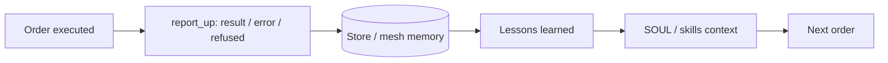

# Roles: Learning from Mistakes and Continuous Skill Upgrade

Design for **roles** (Army ranks, agents, gateways) that **learn from their mistakes** and **upgrade their skills over time** — every order and every day — using the existing mesh memory, skills, and Army order/report flow. No OpenClaw protocol change required.

**Last updated:** February 2026

---

## 1. Goals

| Goal | Description |
|------|-------------|
| **Learn from mistakes** | When an order fails, is refused, or returns a poor result, capture what went wrong and feed it back so the same role/node (and optionally the mesh) avoids repeating it. |
| **Upgrade skills continuously** | Use outcomes (success and failure) to update shared “lessons learned” and, where appropriate, skill content (SOUL snippets, procedures) so roles get better every day and every time they execute. |
| **Keep it simple** | Use existing mesh memory and skills; optional small “learning loop” that reacts to order outcomes and writes memory or skill patches. |

This doc extends the [Army of OpenClaw](OPENCLAW_ARMY_OF_OPENCLAW.md) (orders, report_up, registry) and [mesh knowledge/skills](OPENCLAW_MESH_KNOWLEDGE_SKILLS_SHARING.md) (memory, skills, store).

---

## 2. Where learning fits in the flow



- **report_up** already carries `result`, `error`, or `status: "refused"` + `reason` (see [OPENCLAW_ARMY_SOUL_BY_RANK.md](OPENCLAW_ARMY_SOUL_BY_RANK.md)).
- A **learning step** (after report_up is stored): read the outcome, derive a short “lesson” (what failed, what to do differently), and write it to **mesh memory** or a **lessons store**.
- **Next time** the same role (or node) runs an order: **SOUL or context** includes “recent lessons for this role” so the agent avoids repeating the same mistake.
- **Skill upgrade**: Periodically (e.g. daily) aggregate lessons into a **skill document** (e.g. `lessons-learned.md`) or append to an existing skill so the whole mesh or unit benefits.

---

## 3. Learning from mistakes

### 3.1 What to capture

| Source | Data to capture |
|--------|------------------|
| **Order completed** | orderId, nodeId, rank/role, payload summary, result summary, ts. Optional: “what worked” for positive reinforcement. |
| **Order failed** | orderId, nodeId, rank/role, error message, deadline exceeded / delivery failure / execution error, ts. |
| **Order refused** | orderId, nodeId, rank/role, reason (e.g. “out of scope”, “missing tool”), ts. |

These already exist in the Army order flow: dispatcher and store have `status`, `result`, `error`; report_up sends result or refused + reason.

### 3.2 Where to store it

**Option A — Mesh memory (recommended)**  
Use the existing [mesh memory](mesh/README.md) with a consistent scope/key convention:

| Scope | Key | Content |
|-------|-----|---------|
| `node` | `<nodeId>:lessons` | Last N lessons for this node (append-only or rolling window). |
| `mesh` | `lessons_by_role:<role>` | Last N lessons for this role (e.g. `research`, `coding`) so any node with that role can read them. |
| `mesh` | `lessons:recent` | Global recent lessons (optional; can be filtered by role in context). |

Each “lesson” can be a short string or a small JSON object, e.g.:

```json
{
  "orderId": "ord-123",
  "nodeId": "sec",
  "role": "research",
  "outcome": "failed",
  "summary": "Deadline exceeded; avoid broad queries without time box.",
  "ts": 1709123456
}
```

**Option B — Dedicated table**  
Add a `lessons` or `feedback` table in the mesh store (e.g. `node_id`, `role`, `order_id`, `outcome`, `summary`, `ts`). Query “recent lessons for node X or role Y” and expose via store API or mesh memory for context.

### 3.3 When to write a lesson

- **On report_up (every time):** When the dispatcher or gateway receives a report (PATCH order with result/error, or bridge message), a **learning hook** runs: build a one-line or short summary and write to mesh memory (Option A) or insert into lessons table (Option B).
- **On deadline exceeded:** The background job that marks orders as failed (e.g. `markOrdersDeadlineExceeded`) can also write a lesson: “Order X timed out; avoid similar payloads without tighter scope or longer deadline.”

Implementation can live in: Army server (after PATCH order), Mission Control proxy (when it sees order updates), or a small sidecar that subscribes to store/API and writes lessons.

---

## 4. Feeding lessons back into context (so roles “see” their mistakes)

- **SOUL / agent context:** Add a short instruction in each role’s SOUL (or in a shared “lessons” skill) that the agent should:
  - **Before executing an order:** Read mesh memory key `node:<myNodeId>:lessons` or `lessons_by_role:<myRole>` (or equivalent) and “avoid repeating past errors listed there.”
  - **After executing:** (Already covered by report_up; the learning hook then appends the new lesson.)

- **Tool or inject:** If the gateway or tool layer can inject context, add “Recent lessons for your role: …” from mesh memory at the start of each task so the LLM sees it without changing SOUL every time.

- **Skill document:** Maintain a shared skill e.g. `lessons-learned.md` that is updated daily (or after each order) with the last N lessons for that unit/role; agents with that skill load it as part of their context.

---

## 5. Upgrading skills every day / every time

### 5.1 Every time (per order)

- After each **report_up**, the learning hook writes one lesson (as above). That is “upgrade every time”: the next order for that node/role already has one more data point in `lessons` memory.
- Optionally: if the outcome is **success** and the result is a reusable pattern (e.g. “always include sources in research reports”), append a short “do more of this” line to the same lessons memory or to a `best_practices` key.

### 5.2 Every day (batch)

- **Daily job** (cron or scheduler):
  1. **Aggregate:** Query lessons (or order outcomes) from the last 24 hours per role/unit.
  2. **Summarize:** Produce a short “Daily lessons” text (e.g. “Research: avoid broad queries; Coding: always run tests before report_up”).
  3. **Write:**  
     - To mesh memory key e.g. `mesh:lessons_daily:YYYY-MM-DD` or append to `lessons_by_role:<role>`, or  
     - To a **skill file** e.g. `lessons-2026-02-28.md` in the mesh skills cache so it’s loaded as a skill next time.
  4. **Optional promotion:** If a lesson appears repeatedly (same error type), promote it into the main SOUL or a standing “constraints” skill for that role (manual or automated).

- **Skill versioning:** When you update a skill (e.g. `lessons-learned.md` or a SOUL snippet), use the existing mesh skill write path (PUT skill, or file in `mesh/skills/`); sync and store will propagate as already designed.

---

## 6. Data shapes (reference)

### 6.1 Lesson entry (in memory or table)

| Field | Type | Description |
|-------|------|-------------|
| `orderId` | string | Order that produced this lesson. |
| `nodeId` | string | Node that executed (or refused). |
| `role` | string | Role/skill (e.g. research, coding). |
| `outcome` | string | `completed`, `failed`, `refused`. |
| `summary` | string | One-line lesson (what to avoid or what to do). |
| `ts` | number | Unix timestamp. |
| `error` or `reason` | string (optional) | Raw error or refusal reason. |

### 6.2 Mesh memory keys (convention)

| Key | Scope | Meaning |
|-----|--------|---------|
| `node:<id>:lessons` | node | Recent lessons for this node (array or concatenated text). |
| `lessons_by_role:<role>` | mesh | Recent lessons for this role. |
| `lessons_daily:YYYY-MM-DD` | mesh | Daily summary for that date (optional). |

---

## 7. Implementation options

| Option | Who writes lessons | Where | When |
|--------|--------------------|--------|------|
| **A. Army server** | Army server (after PATCH /army/orders/:id with result/error) | Mesh memory via store API or direct cache write | Every report_up |
| **B. Mission Control proxy** | Proxy (when it forwards order updates or fetches orders) | Store API or mesh memory | On order state change |
| **C. Sidecar / cron** | Small script or service | Reads store (orders + outcomes), writes mesh memory or lessons table | Every report_up (poll) or daily batch |
| **D. Gateway / agent tool** | Agent’s report_up tool | Writes to mesh memory before or after calling dispatcher PATCH | Every time agent reports |

Recommendation: start with **Option A or D** so lessons are written at the same time as the order is updated; no extra subscription needed. Daily aggregation can be a separate cron job that reads lessons (or orders) and writes `lessons_daily` or updates a skill file.

---

## 8. SOUL addition (per role)

Add a short block to each rank’s SOUL (e.g. in [OPENCLAW_ARMY_SOUL_BY_RANK.md](OPENCLAW_ARMY_SOUL_BY_RANK.md)) so they consistently read and use lessons:

```markdown
## Learning and improvement
- Before executing an order, read mesh memory for recent lessons for your role (e.g. key `lessons_by_role:<your role>`) and avoid repeating past errors.
- When you report_up, include a brief note if something went wrong so it can be recorded as a lesson for future tasks.
- You improve by applying these lessons on every order and by following updated skill docs (e.g. lessons-learned) when provided.
```

---

## 9. References

| Doc | Purpose |
|-----|---------|
| [OPENCLAW_ARMY_OF_OPENCLAW.md](OPENCLAW_ARMY_OF_OPENCLAW.md) | Orders, report_up, registry, dispatcher. |
| [OPENCLAW_ARMY_SOUL_BY_RANK.md](OPENCLAW_ARMY_SOUL_BY_RANK.md) | SOUL per rank; add “Learning and improvement” there. |
| [OPENCLAW_MESH_KNOWLEDGE_SKILLS_SHARING.md](OPENCLAW_MESH_KNOWLEDGE_SKILLS_SHARING.md) | Mesh memory and skills; where lessons and skill upgrades live. |
| [mesh/README.md](mesh/README.md) | Memory and skill message formats; cache and store. |
| [PRD.md](PRD.md) | Mesh scope/key model; store. |

---

## 10. Summary

- **Learning from mistakes:** Capture order outcomes (result, error, refused + reason) and write them as short “lessons” to mesh memory (or a lessons table) keyed by node and/or role.
- **Every time:** After each report_up, a learning hook writes one lesson; next order for that role/node gets “recent lessons” in context (via SOUL instruction + mesh memory read).
- **Every day:** A daily job aggregates lessons, writes a daily summary or updates a `lessons-learned` skill so roles keep upgrading.
- **No protocol change:** Uses existing mesh memory, skills, and Army order/report flow; only conventions and optional code (Army server, proxy, or sidecar) to write and read lessons.
