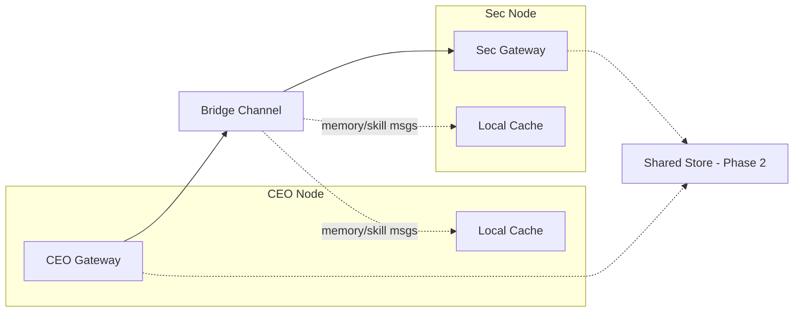
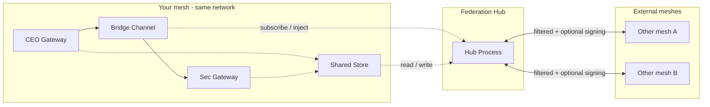

# Product Requirements: OpenClaw Mesh — Shared Knowledge and Skills

**Version:** 0.1 (draft)  
**Status:** Draft  
**Design source:** [OPENCLAW_MESH_KNOWLEDGE_SKILLS_SHARING.md](OPENCLAW_MESH_KNOWLEDGE_SKILLS_SHARING.md)

---

## 1. Overview

Enable two or more **independent OpenClaw gateways** (a mesh) to share **knowledge** (memory) and **skills** (SOUL/STYLE snippets, procedures) so the mesh behaves like a single distributed system. This PRD specifies requirements; implementation uses the existing bridge (channel/webhook) and optional shared store or sync—**no OpenClaw gateway protocol change** is required for Phase 1 or 2.

---

## 2. Glossary

| Term | Definition |
|------|-------------|
| **Mesh** | Two or more independent OpenClaw gateways (Option B in the two-node design), each with its own agents, channels, and config, that cooperate as peers. |
| **Shared memory** | Knowledge (facts, context, preferences) with explicit scope (node / mesh / user) that can be read or synced across mesh nodes. |
| **Skill sharing** | Exchanging reusable capabilities: SOUL/STYLE snippets, procedure docs, and skill descriptors so nodes can reuse behaviors. |
| **Bridge** | The existing channel (e.g. Telegram/Discord) or webhook used for cross-gateway communication (e.g. CEO → Sec tasks). |
| **Federation hub** | Optional node that connects the mesh to external meshes: single gateway for inbound (external → your mesh) and outbound (your mesh → external) traffic, with filtering and optional signing. |
| **External mesh** | Another OpenClaw mesh (different org, bridge, or network) that the federation hub can exchange selected memory/skills with. |
| **Federation scope** | Scope `federation` or an allow-list of keys; only such data is eligible to be sent to external meshes. |
| **Provenance (external)** | External-origin data is tagged with `nodeId: "external:<mesh-id>:<node-id>"` (and optionally `sourceMeshId`) for auditing and filtering. |

---

## 3. Problem Statement

| | Description |
|--|-------------|
| **Current state** | CEO (Mac Mini) and Sec (Synology) communicate only via a task bridge. No cross-gateway memory or skill sync; each node is a silo. |
| **Pain** | Redundant learning, inconsistent behavior across nodes, no shared context (e.g. user preferences, project context). |
| **Desired state** | Mesh nodes share selected memory and skills with explicit scope and optional discovery, reusing the existing bridge and optional shared store/sync. |

---

## 4. Goals and Success Criteria

**Goals**

1. **Shared memory** with tiered scope (node / mesh / user).
2. **Skill sharing**: descriptors, SOUL/STYLE snippets, procedures.
3. **No OpenClaw protocol change** for v1 (Phase 1 and 2).
4. **Phased delivery**: bridge-first, then shared store, then local-first sync.

**Success criteria (Phase 1)**

- At least two nodes can exchange **structured memory and skill messages** over the existing bridge.
- At least one node can **ingest** them into a local cache and **use them in context**.

---

## 5. User Personas / Stakeholders

| Persona | Need |
|---------|------|
| **Mesh operator** | Runs multiple OpenClaw instances (e.g. CEO + Sec); wants consistent behavior and shared context across nodes. |
| **Agent (per node)** | Benefits from mesh memory and skills without extra manual config where possible. |
| **Raise The OpenClaw reader** | Wants a clear, implementable spec (PRD + design doc). |

---

## 6. Scope

| In scope | Out of scope |
|----------|--------------|
| Message formats (memory, skill); local cache layout; optional request/response over bridge. | Changes to OpenClaw gateway or node protocol. |
| Phase 2: shared store schema and access patterns. | Implementation of a specific bridge transport (Telegram/Discord/etc.) or shared store backend—implementation follows PRD. |
| Phase 3: local-first sync behavior and conflict resolution. | |
| Integration points with Mission Control and CEO→Sec bridge. | |
| Optional **Federation Hub**: connect mesh to external meshes; filter in/out, provenance, optional signing. | |

---

## 7. Functional Requirements by Phase

### Phase 1 — Bridge + Structured Messages

| ID | Requirement |
|----|-------------|
| **FR-1.1** | **Mesh memory message format.** Must include: `type` (string, e.g. `"memory"`), `scope` (string), `key` (string), `value` (any JSON-serializable), `nodeId` (string), `ts` (timestamp). Optional: `id`, `userScope`. |
| **FR-1.2** | **Mesh skill message format.** Must include: `type` (string, e.g. `"skill"`), `name` (string), `sourceNode` (string), `content` (string or URL). Optional: `id`, `ts`. |
| **FR-1.3** | **Local cache.** Specify a node-local store for mesh memory and/or skills (e.g. `~/.openclaw/mesh-memory.json` and/or `~/.openclaw/mesh/skills/` layout). Specify how agents/tools read and write it (e.g. tool names, file paths). |
| **FR-1.4** | **Optional: request/response over bridge.** Convention for “request memory key X” / “request skill Y” and “response: value”—discovery/registry-style without a central server. |

### Phase 2 — Shared Store

| ID | Requirement |
|----|-------------|
| **FR-2.1** | **Shared memory schema.** At least: `scope`, `key`, `value`, `node_id`, `updated_at`. Scopes: `node` \| `mesh` \| `user:<id>`. |
| **FR-2.2** | **Shared skills schema.** At least: `name`, `source_node`, `content` or `path`, `updated_at`. |
| **FR-2.3** | **Access model.** Document how nodes read/write (API or file sync); authentication/authorization assumptions. |

### Phase 3 — Local-First Sync

| ID | Requirement |
|----|-------------|
| **FR-3.1** | **Local replica.** Each node maintains a local replica of mesh memory and mesh skills; sync protocol is Merkle-DAG or CRDT-style. |
| **FR-3.2** | **Conflict resolution.** Defined rule: e.g. last-write-wins by key or CRDT merge. |
| **FR-3.3** | **Optional: sync efficiency.** Bloom filter or hash summary to reduce sync payload. |

---

## 8. Non-Functional Requirements

| ID | Requirement |
|----|-------------|
| **NFR-1** | No dependency on OpenClaw protocol changes for Phase 1 and 2. |
| **NFR-2** | **Security:** Tokens and secrets never in mesh-shared memory; encryption in transit for any new sync channel; access control for shared store (Phase 2). |
| **NFR-3** | **Eventual consistency:** Mesh remains usable when nodes are temporarily offline (Phase 1: best-effort; Phase 3: explicit). |
| **NFR-4** | **Backward compatibility:** Existing CEO→Sec task flow unchanged; new message types are additive on the bridge. |

---

## 9. Data and Message Conventions (Reference)

**What to put in shared memory**

- User preferences (e.g. short answers, use metric).
- Project or context summaries.
- Cross-node session summaries (e.g. “CEO asked Sec to do X; result: Y”).
- Factual cache (e.g. user’s timezone, current focus project).

**What to put in skill sharing**

- SOUL.md snippets (triage rules, tone).
- Procedure docs (how to hand off to Sec, when to escalate to CEO).
- Skill descriptors (e.g. “I can do: triage, reminders, light research”).
- STYLE.md or templates for consistent formatting.

**Keep node-local (do not share)**

- Secrets, tokens, credentials.
- Node-specific tools and bindings (unless explicitly publishing “I have tool X”).
- Purely local session state with no mesh value.

*Rationale and detail: [OPENCLAW_MESH_KNOWLEDGE_SKILLS_SHARING.md](OPENCLAW_MESH_KNOWLEDGE_SKILLS_SHARING.md) §5.*

**Federation (optional)**

- Data that may be shared with **external meshes** uses scope `federation` or an allow-list of keys (`federationKeys`). The federation hub only sends out such data; internal-only scopes (`mesh`, `node`, `user:<id>`) stay within your mesh.
- Messages from external meshes are stored with provenance `nodeId: "external:<mesh-id>:<node-id>"` so agents and sync can distinguish origin. See [OPENCLAW_MESH_FEDERATION_HUB.md](OPENCLAW_MESH_FEDERATION_HUB.md).

---

## 10. Dependencies and Assumptions

**Dependencies**

- Existing **bridge** (channel or webhook) between mesh nodes.
- OpenClaw agent **memory** and **SOUL.md** / **agentDir** as today.

**Assumptions**

- Mesh nodes are **trusted peers** or trust is enforced out-of-band.
- Bridge transport is **available and reliable** for Phase 1.

---

## 11. Risks and Mitigations

| Risk | Mitigation |
|------|------------|
| Bridge message volume or ordering issues. | Phase 1 targets low volume; optional request/response and local cache reduce chatter; Phase 2/3 move heavy data to store/sync. |
| Conflicting updates to shared memory. | Phase 1: best-effort. Phase 2: single store with clear ownership. Phase 3: CRDT or last-write-wins. |

---

## 12. Architecture (Mesh Topology)

**Internal mesh (CEO + Sec + bridge + store):**

- **Solid lines:** Existing task flow (bridge).
- **Dotted:** Phase 1 local caches (ingest from bridge); Phase 2 optional shared store.

**With optional Federation Hub (connect to external meshes):**

See [OPENCLAW_MESH_FEDERATION_HUB.md](OPENCLAW_MESH_FEDERATION_HUB.md) for hub responsibilities, config, and security.

---

## 13. References and Related Docs

| Doc | Purpose |
|-----|---------|
| [OPENCLAW_MESH_KNOWLEDGE_SKILLS_SHARING.md](OPENCLAW_MESH_KNOWLEDGE_SKILLS_SHARING.md) | Design: research, options, phased approach, content guidelines. |
| [OPENCLAW_TWO_NODE_MAC_NAS_DESIGN.md](OPENCLAW_TWO_NODE_MAC_NAS_DESIGN.md) | Two-node setup; Option B = two gateways = mesh. |
| [OPENCLAW_MAC_MINI_CEO_PROMPTS.md §4](OPENCLAW_MAC_MINI_CEO_PROMPTS.md#4-ceo--sec-delegation-cross-gateway) | CEO → Sec delegation (bridge channel/webhook). |
| [OPENCLAW_MISSION_CONTROL_DASHBOARD.md](OPENCLAW_MISSION_CONTROL_DASHBOARD.md) | Dashboard; can surface mesh memory/skills if store or bridge parser exists. |
| [OPENCLAW_MESH_FEDERATION_HUB.md](OPENCLAW_MESH_FEDERATION_HUB.md) | Federation hub: connect mesh to external meshes; topology, config, filtering, signing. |

**Research references (see design doc §7):** SEDM, Collaborative Memory, SHIMI, OpenAgents+Milvus, SkillOrchestra, D³MAS, NextGraph/CRDTs, Agent Mesh (ACP, AMP).
