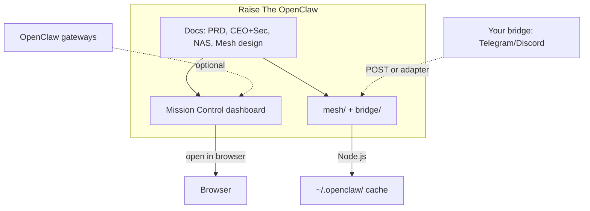
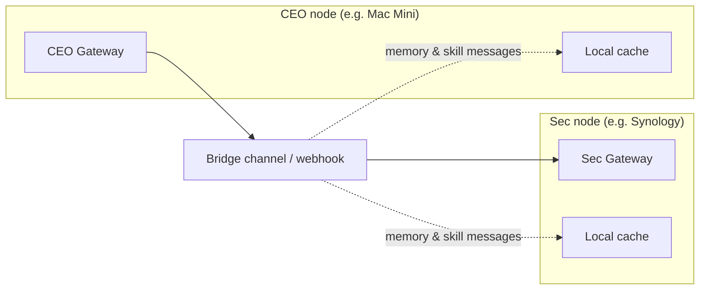
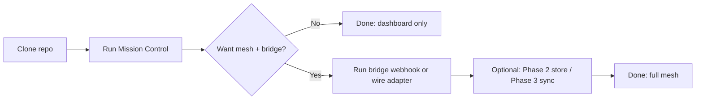

# Raise The OpenClaw

**Curated recipes and reference implementations for [OpenClaw](https://clawdocs.org)** — the open-source autonomous AI agent framework. Run CEO-style orchestrators, multi-node meshes, and dashboards with copy-paste docs and runnable code.

---

## Diagrams

### Raise The OpenClaw at a glance

### Mesh: two nodes and the bridge

### Get started: what to run and when

---

## Get started A to Z

**Full step-by-step:** **[GETTING_STARTED.md](GETTING_STARTED.md)** — prerequisites, clone, run dashboard, mesh, bridge, optional store/sync, and full CEO+Sec setup.

**Short path:**

1. **Prerequisites** — Node.js (v18+), Git, a browser. OpenClaw is optional until you connect real gateways.
2. **Clone** — `git clone https://github.com/bgoldmann/Raise-The-OpenClaw.git && cd Raise-The-OpenClaw` (or use your fork’s URL)
3. **Mission Control (no install)** — Open `mission-control/index.html` in a browser, or run `npx serve mission-control` and open http://localhost:3000.
4. **Mesh + bridge (optional)** — No `npm install` for mesh/bridge. Run `node bridge/webhook-server.js 4077` to accept POSTs; or call `handleBridgeMessage(payload, { unwrap: 'telegram' })` from your bot. Cache lives under `~/.openclaw/` (or `OPENCLAW_HOME`).
5. **CEO + Sec (optional)** — Install OpenClaw on both nodes, use [CEO + Sec prompts](OPENCLAW_MAC_MINI_CEO_PROMPTS.md) and a shared bridge channel or webhook; wire mesh ingest as in step 4.

---

## What’s in Raise The OpenClaw

| Area | What you get |
|------|----------------|
| **Multi-node mesh** | Share memory and skills across independent OpenClaw gateways (CEO ↔ Sec). Full PRD, message formats, local cache, bridge wiring, shared store schema, and local-first sync. |
| **Mission Control** | Single dashboard for two (or more) gateways: **live WebSocket** to OpenClaw gateways, optional **backend proxy** (tokens server-side), overview, gateways table, per-node detail, bridge status, **export** (CSV/JSON), **customizable panels**. Design doc + runnable SPA + proxy. |
| **CEO + Sec setup** | Mac Mini (CEO) and Synology (Sec) with copy-paste SOUL.md prompts, bindings, and CEO→Sec delegation over a bridge (Telegram/Discord or webhook). |
| **NAS + hardware** | Best-practice designs for OpenClaw on Synology DS1621xs+ and Mac mini: Docker, network, one-cluster vs two-instance. |

Everything is **documentation-first** with **reference code** where it helps: no OpenClaw protocol changes required.

---

## Quick links

- **[Get started A to Z](GETTING_STARTED.md)** — Prerequisites, clone, run dashboard, mesh, bridge, and full CEO+Sec setup.
- **[Product Requirements: OpenClaw Mesh](PRD.md)** — Problem, goals, phased requirements (bridge → shared store → local-first sync), NFRs.
- **[Mission Control dashboard](mission-control/index.html)** — Open in a browser. Live gateway connection, overview cards, gateways table, bridge status, add/edit gateway, export, customizable panels. Use **[Mission Control proxy](mission-control/proxy/README.md)** for tokens server-side.
- **[CEO + Sec prompts](OPENCLAW_MAC_MINI_CEO_PROMPTS.md)** — SOUL.md for CEO, Sec, Research, Coding, Notes, Trading, Family; CEO→Sec bridge options.
- **[Enterprise security](ENTERPRISE_SECURITY.md)** — Proxy, bridge auth, TLS. **[Observability](OBSERVABILITY.md)** — Logging, metrics, health. **[Deployment](DEPLOYMENT.md)** — Docker Compose, Kubernetes. **[Runbooks](docs/RUNBOOKS.md)** — Add gateway, rotate token, recover store.
- **[Changelog](changelog.md)** — Version history.

---

## Reference implementations

| Repo path | Purpose |
|----------|---------|
| **[mesh/](mesh/)** | **Phase 1:** Message formats (memory/skill), local cache (`~/.openclaw/mesh-memory.json`, `mesh/skills/`), bridge ingest, request/response over bridge. **Phase 2:** [mesh/store/](mesh/store/) — shared store schema (SQLite), access model, optional client. **Phase 3:** [mesh/sync/](mesh/sync/) — sync protocol, LWW merge, optional hash summary. |
| **[bridge/](bridge/)** | Wire mesh into your bridge: `handleBridgeMessage(payload, { unwrap: 'telegram' })` and webhook server (`POST /ingest`, `POST /bridge`) with optional **API key/Bearer auth**, **structured logging**, **/metrics**, **/health** with cache writability check. |
| **[mission-control/](mission-control/)** | Single-page dashboard: **live WebSocket** to gateways (OpenClaw protocol), **proxy** in [mission-control/proxy/](mission-control/proxy/) (tokens server-side), gateways, stats, tasks, jobs, approvals, activity, export, customizable panels. |
| **[federation-hub/](federation-hub/)** | **Federation Hub** — connect your mesh to other meshes: `POST /federation/in` (inbound), `POST /federation/share` (internal intel share), outbound (poll store → POST to external), optional store-to-bridge fan-out, optional signing, `GET /metrics`. Config: `config.example.json`; design: [OPENCLAW_MESH_FEDERATION_HUB.md](OPENCLAW_MESH_FEDERATION_HUB.md), [OPENCLAW_FEDERATION_HUB_INTEL_SHARE.md](OPENCLAW_FEDERATION_HUB_INTEL_SHARE.md). |
| **[mesh/store/api-server.js](mesh/store/api-server.js)** | **Mesh store HTTP API** — GET/PUT list memory and skills; optional auth and rate limiting. Run with `MESH_STORE_DB_PATH`; see [mesh/store/README.md](mesh/store/README.md). |
| **[scripts/mesh-cli.js](scripts/mesh-cli.js)** | **Mesh CLI** — get/put/list memory and skills (local cache or `MESH_STORE_URL`). |
| **[army/server.js](army/server.js)** | **Army registry + dispatcher** — POST /army/register, GET /army/nodes, POST /army/orders; resolves addressee, sends order to target ingest_url; failover, metrics. See [army/README.md](army/README.md). Mission Control shows **Army — Command Post** (unit view, roster, orders queue, issue order) when proxy has `OPENCLAW_MC_ARMY_URL`. |

All runnable with **Node.js** (no extra deps for mesh/bridge; Mission Control proxy uses `ws`; optional `better-sqlite3` for mesh store and Army).

---

## Documentation (docs)

| Doc | Description |
|-----|--------------|
| [PRD — OpenClaw Mesh](PRD.md) | Product requirements: shared knowledge and skills across a mesh of gateways. |
| [PRD — Expansion](PRD_EXPANSION.md) | Expansion (Phase 2): store API, federation outbound, signing, multi-tenancy, rate limits, public APIs, mesh/federation view, runbooks, optional CLI. |
| [Mesh design & research](OPENCLAW_MESH_KNOWLEDGE_SKILLS_SHARING.md) | How to share memory and skills; bridge vs shared store vs CRDT/sync; references (SEDM, SHIMI, D³MAS, agent mesh). |
| [Mission Control design](OPENCLAW_MISSION_CONTROL_DASHBOARD.md) | Dashboard architecture, config schema, UI sections, security, reference implementation options. |
| [CEO + Sec prompts](OPENCLAW_MAC_MINI_CEO_PROMPTS.md) | Copy-paste SOUL.md, bindings, agentToAgent, CEO→Sec delegation (bridge channel/webhook). |
| [CEO + sub-agents setup](OPENCLAW_CEO_SUBAGENTS_SETUP.md) | OpenClaw as CEO with specialist sub-agents: architecture, config, SOUL examples. |
| [Two-node: Mac Mini + Synology](OPENCLAW_TWO_NODE_MAC_NAS_DESIGN.md) | One cluster vs two independent instances; Docker, network. |
| [NAS + Mac mini (Feb 2026)](OPENCLAW_NAS_MACMINI_FEB2026.md) | Gateway on Synology, Ollama on Mac mini: config, network, hardware tiers. |
| [Enterprise security](ENTERPRISE_SECURITY.md) | Mission Control proxy, bridge auth, TLS, mesh store access. |
| [Observability](OBSERVABILITY.md) | Logging, metrics, health, audit, retention. |
| [Deployment](DEPLOYMENT.md) | Docker Compose, Kubernetes, single-host. |
| [Enterprise expand](docs/ENTERPRISE_EXPAND.md) | Multi-tenancy, public APIs, rate limits, message signing. |
| [Federation hub](OPENCLAW_MESH_FEDERATION_HUB.md) | Connect your mesh to external meshes: topology, config, filtering, provenance, optional signing; reference impl in [federation-hub/](federation-hub/). |
| [Federation hub intel share](OPENCLAW_FEDERATION_HUB_INTEL_SHARE.md) | Memory via store or POST /federation/share; Army ranking and unit/theater; share endpoint, store-to-bridge. |
| [Army of OpenClaw](OPENCLAW_ARMY_OF_OPENCLAW.md) | US Army–style hierarchy: chain of command, ranks/units, orders, registry, dispatcher, Mission Control as command post; recommended LLM model(s) by rank and optional per-node model_ranking. |
| [Army strategies](OPENCLAW_ARMY_STRATEGIES.md) | Strategy names and semantics for orders (research, default, attack placeholder); execution approach per order. |
| [Army SOUL by rank](OPENCLAW_ARMY_SOUL_BY_RANK.md) | Copy-paste SOUL prompts per rank (General, Colonel, Captain, Sergeant, Specialist); skills (MOS), tools by rank; see Army doc for recommended model(s) by rank. |
| [Runbooks](docs/RUNBOOKS.md) | Add gateway, rotate token, recover mesh store, scale bridge. |
| [30-day X tweet plan](docs/30_DAY_TWEET_PLAN.md) | Content plan for X (Twitter): goals, pillars, calendar, two tweet drafts, traffic tips. |

---

## Changelog

See **[changelog.md](changelog.md)** for version history.

---

## License and contributing

Raise The OpenClaw is shared as reference documentation and code. If you use or adapt it, attribution is appreciated. For OpenClaw itself, see [clawdocs.org](https://clawdocs.org) and the official OpenClaw repositories.

Suggestions and pull requests (e.g. new recipes, fixes, or clearer wording) are welcome.
