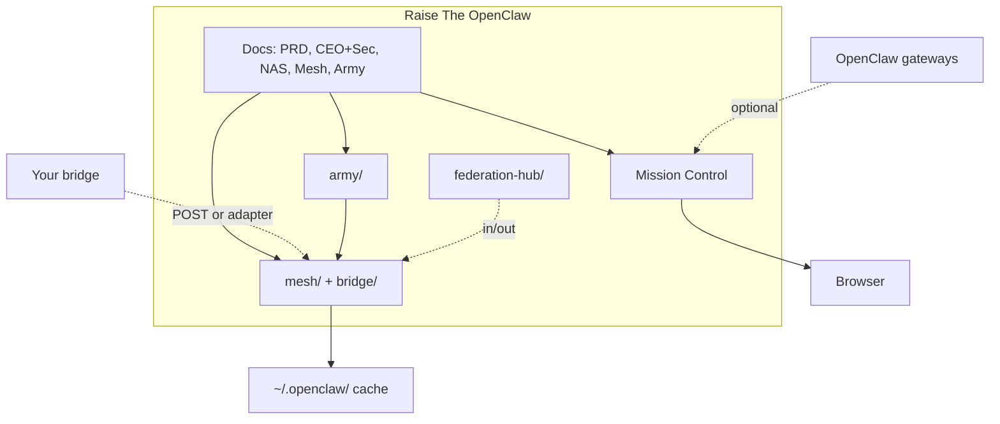
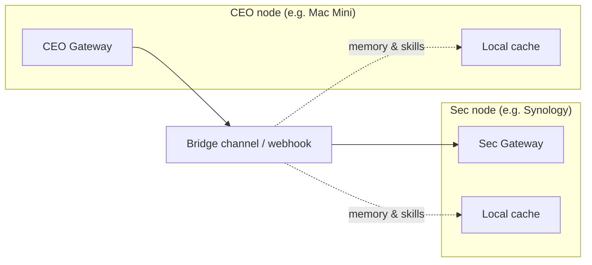

# Raise The OpenClaw

**Curated recipes and reference implementations for [OpenClaw](https://clawdocs.org)** — the open-source autonomous AI agent framework. Run CEO-style orchestrators, multi-node meshes, Mission Control dashboards, and Army-style command structures using copy-paste docs and runnable Node.js code. No OpenClaw protocol changes required.

---

## What this repo is

Raise The OpenClaw is a **documentation-first cookbook** for people running or extending [OpenClaw](https://clawdocs.org). You get:

- **Design docs and PRDs** — Mesh sharing, Mission Control, Federation Hub, Army of OpenClaw, CEO→Sec delegation.
- **Reference implementations** — Runnable Node.js code for mesh (messages, cache, store, sync), bridge ingest, Mission Control (SPA + proxy), federation hub, Army registry/dispatcher, mesh store API, and CLI.
- **Recipes** — CEO + Sec prompts, two-node Mac + NAS setups, SOUL by rank, runbooks, deployment and observability.

Everything is **optional and composable**: use the dashboard alone, add mesh + bridge, add store/sync, add federation or Army as needed.

---

## Quick start

| Step | Command or action |
|------|--------------------|
| 1. Clone | `git clone https://github.com/bgoldmann/Raise-The-OpenClaw.git && cd Raise-The-OpenClaw` |
| 2. Run dashboard | Open `mission-control/index.html` in a browser, or `npx serve mission-control` then open http://localhost:3000 |
| 3. (Optional) Mesh + bridge | `node bridge/webhook-server.js 4077` — POST memory/skill messages to `http://localhost:4077/ingest` or `/bridge` |
| 4. (Optional) Full path | See **[GETTING_STARTED.md](GETTING_STARTED.md)** for store, sync, CEO+Sec, proxy, and Army |

**Prerequisites:** Node.js 18+, Git, a browser. OpenClaw is optional until you connect real gateways; Mission Control works with mock data when disconnected.

---

## Architecture at a glance

### Mesh: two nodes and the bridge

---

## What’s in the repo

| Area | What you get |
|------|----------------|
| **Multi-node mesh** | Share memory and skills across OpenClaw gateways. Phase 1: message formats, local cache, bridge ingest. Phase 2: shared SQLite store and HTTP API. Phase 3: local-first sync (LWW). PRD, schemas, `mesh/`, `mesh/store/`, `mesh/sync/`. |
| **Bridge** | Wire mesh into Telegram/Discord or any webhook: `handleBridgeMessage()` adapter and small webhook server. Optional API key/Bearer auth, `/metrics`, `/health`, `BRIDGE_MAX_BODY_SIZE`. |
| **Mission Control** | Single-page dashboard for multiple gateways: live WebSocket (or one via proxy), overview cards, gateways table, stats, Working/Tasks/Jobs/Approvals/Activity, Army Command Post when configured, export (CSV/JSON), customizable panels. Design doc + `mission-control/` SPA + `mission-control/proxy/`. |
| **Federation Hub** | Connect your mesh to other meshes: `POST /federation/in`, `POST /federation/share`, outbound (poll store → POST to external), store-to-bridge, optional Ed25519 signing, `/metrics`. `federation-hub/` + design docs. |
| **Army of OpenClaw** | US Army–style hierarchy: registry (nodes by rank/unit/skill), orders, dispatcher (sends orders to ingest URLs, failover). Mission Control “Army — Command Post”: unit view, roster, orders queue, issue order. `army/server.js`, SOUL by rank, strategies. **Roles learning & skill upgrade:** Roles learn from mistakes and upgrade skills every order and every day (lessons in mesh memory, daily aggregation); see [OPENCLAW_ROLES_LEARNING_AND_SKILL_UPGRADE.md](OPENCLAW_ROLES_LEARNING_AND_SKILL_UPGRADE.md). |
| **CEO + Sec** | Mac Mini (CEO) and Synology (Sec): SOUL prompts, bindings, CEO→Sec delegation over bridge. NAS + hardware notes. |
| **Operational** | Runbooks, enterprise security, observability, deployment (Docker, K8s), message signing, multi-tenancy, rate limiting. |

---

## Reference implementations (runnable code)

| Path | Purpose |
|------|---------|
| **[mesh/](mesh/)** | Phase 1: memory/skill message formats, local cache (`~/.openclaw/mesh-memory.json`, `mesh/skills/`), bridge ingest, request/response. Phase 2: [mesh/store/](mesh/store/) — SQLite schema, client, optional [api-server.js](mesh/store/api-server.js) (GET/PUT memory and skills, auth, rate limit). Phase 3: [mesh/sync/](mesh/sync/) — sync protocol, LWW merge. |
| **[bridge/](bridge/)** | `handleBridgeMessage(payload, { unwrap: 'telegram' })` and webhook server (`POST /ingest`, `POST /bridge`). Optional auth, logging, `GET /metrics`, `GET /health`. |
| **[mission-control/](mission-control/)** | Single-file SPA: live WebSocket to gateways, optional [proxy](mission-control/proxy/) (tokens server-side, single `/ws`), gateways, stats, tasks, jobs, approvals, Army section, export, panel visibility. |
| **[federation-hub/](federation-hub/)** | `POST /federation/in`, `POST /federation/share`, outbound (store poll → external meshes), store-to-bridge, optional signing. Config: `config.example.json`. |
| **[army/server.js](army/server.js)** | Registry (POST/GET/PATCH nodes, GET units), dispatcher (POST orders, resolve addressee, POST to ingest_url, failover). Optional `ARMY_AUTH_BEARER`, `ARMY_REGISTRY_TTL_SEC`, `GET /metrics`. Mission Control shows Army when proxy has `OPENCLAW_MC_ARMY_URL`. |
| **[scripts/mesh-cli.js](scripts/mesh-cli.js)** | CLI: get/put/list memory and skills (local cache or `MESH_STORE_URL`). |

**Run:** Node.js 18+; no extra deps for mesh/bridge. Proxy uses `ws`. Optional `better-sqlite3` for mesh store and Army. From repo root: `npm test`, `npm run serve:mc`, `npm run run:bridge`, `npm run run:mesh-cli`, `npm run run:lessons-daily` (daily lessons aggregation; set `MESH_STORE_DB_PATH`).

---

## Documentation

| Doc | Description |
|-----|-------------|
| [Get started A to Z](GETTING_STARTED.md) | Prerequisites, clone, dashboard, mesh, bridge, store, sync, CEO+Sec, proxy, Army. |
| [PRD — OpenClaw Mesh](PRD.md) | Product requirements: shared knowledge and skills across a mesh. |
| [PRD — Expansion](PRD_EXPANSION.md) | Store API, federation, signing, multi-tenancy, rate limits, public APIs. |
| [Mesh design & research](OPENCLAW_MESH_KNOWLEDGE_SKILLS_SHARING.md) | How to share memory and skills; bridge vs store vs sync. |
| [Mission Control design](OPENCLAW_MISSION_CONTROL_DASHBOARD.md) | Dashboard architecture, config, UI, security. |
| [CEO + Sec prompts](OPENCLAW_MAC_MINI_CEO_PROMPTS.md) | SOUL.md, bindings, CEO→Sec bridge options. |
| [CEO + sub-agents](OPENCLAW_CEO_SUBAGENTS_SETUP.md) | OpenClaw as CEO with specialist sub-agents. |
| [Two-node Mac + Synology](OPENCLAW_TWO_NODE_MAC_NAS_DESIGN.md) | One cluster vs two instances; Docker, network. |
| [NAS + Mac mini (Feb 2026)](OPENCLAW_NAS_MACMINI_FEB2026.md) | Gateway on Synology, Ollama on Mac mini. |
| [Federation hub](OPENCLAW_MESH_FEDERATION_HUB.md) | Topology, config, filtering, provenance, signing. |
| [Federation hub intel share](OPENCLAW_FEDERATION_HUB_INTEL_SHARE.md) | Memory via store or `/federation/share`; Army ranking. |
| [Army of OpenClaw](OPENCLAW_ARMY_OF_OPENCLAW.md) | Chain of command, ranks/units, orders, registry, dispatcher. |
| [Army strategies](OPENCLAW_ARMY_STRATEGIES.md) | Order strategies (research, default, attack). |
| [Army SOUL by rank](OPENCLAW_ARMY_SOUL_BY_RANK.md) | Copy-paste SOUL per rank (General → Specialist). |
| [Roles: learning & skill upgrade](OPENCLAW_ROLES_LEARNING_AND_SKILL_UPGRADE.md) | Roles learn from mistakes; upgrade skills every order and every day. |
| [Enterprise security](ENTERPRISE_SECURITY.md) | Proxy, bridge auth, TLS, store access. |
| [Observability](OBSERVABILITY.md) | Logging, metrics, health, audit. |
| [Deployment](DEPLOYMENT.md) | Docker Compose, Kubernetes, single-host. |
| [Runbooks](docs/RUNBOOKS.md) | Add gateway, rotate token, recover store, Army runbooks. |
| [30-day X tweet plan](docs/30_DAY_TWEET_PLAN.md) | Content plan and tweet drafts for X/Twitter. |

---

## Changelog

See **[CHANGELOG.md](CHANGELOG.md)** for version history.

---

## License and contributing

Raise The OpenClaw is shared as reference documentation and code. Attribution appreciated if you use or adapt it. For OpenClaw itself, see [clawdocs.org](https://clawdocs.org) and the official OpenClaw repositories.

Suggestions and pull requests (new recipes, fixes, clearer wording) are welcome.
